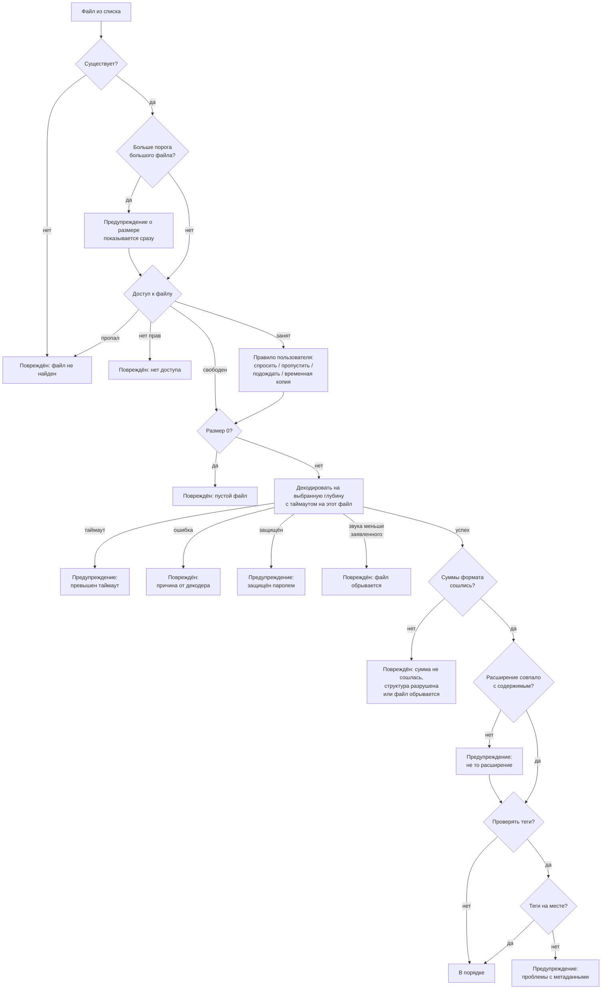
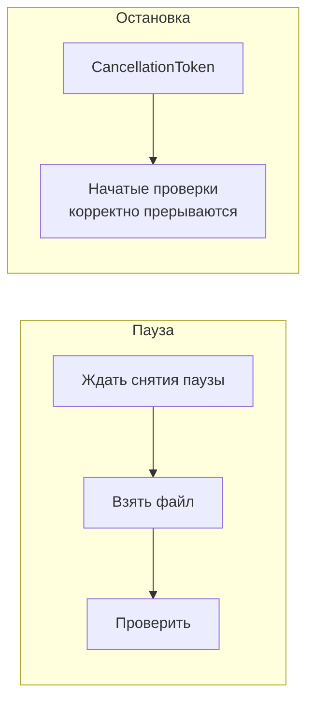

# Music Scan Integrity — устройство программы

Технический разбор: как именно устроена проверка, какие технологии и почему выбраны,
где какие решения приняты. Документ для того, кто открыл репозиторий и хочет
разобраться во внутренностях, не читая весь код подряд.

Поверхностное описание и инструкция по сборке — в [README.md](../README.md).
Исходные требования — в [01_SPECIFICATION.md](01_SPECIFICATION.md),
[02_ARCHITECTURE.md](02_ARCHITECTURE.md), [03_IMPLEMENTATION_GUIDE.md](03_IMPLEMENTATION_GUIDE.md).

---

## Содержание

1. [Карта проекта](#1-карта-проекта)
2. [Технологии и почему они](#2-технологии-и-почему-они)
3. [Как проверяется один файл](#3-как-проверяется-один-файл)
4. [Декодирование через BASS](#4-декодирование-через-bass)
5. [Определение формата по содержимому](#5-определение-формата-по-содержимому)
6. [Чтение тегов](#6-чтение-тегов)
7. [Занятые файлы](#7-занятые-файлы)
8. [Движок проверки](#8-движок-проверки)
9. [Плейлисты](#9-плейлисты)
10. [Настройки](#10-настройки)
11. [Отчёты](#11-отчёты)
12. [Почему в программе нет журнала](#12-почему-в-программе-нет-журнала)
13. [Интерфейс](#13-интерфейс)
14. [Работа на больших коллекциях](#14-работа-на-больших-коллекциях)
15. [Тесты](#15-тесты)
16. [Границы применимости](#16-границы-применимости)

---

## 1. Карта проекта

Два проекта плюс тесты:

```
MusicScanIntegrity.Core   ядро: всё, что решает задачу
MusicScanIntegrity.App    интерфейс: WPF, окна, привязки
MusicScanIntegrity.Core.Tests  тесты ядра
```

**Ядро ничего не знает об интерфейсе.** Это не догма ради архитектуры, а условие
проверяемости: весь конвейер проверки, движок с параллельностью, разбор плейлистов
и формирование отчётов покрыты обычными модульными тестами, потому что для их запуска
не нужно ни окна, ни диспетчера WPF. Всё, что ядру нужно от интерфейса, оно получает
через интерфейсы: `ILockedFileDecisionProvider` (спросить пользователя),
`IProgress`/события (сообщить о ходе).

Ядро собрано под `net10.0-windows` — не из-за WPF, а из-за одного P/Invoke
в `RstrtMgr.dll` (определение программы-владельца занятого файла).

Состав ядра по папкам:

| Папка | За что отвечает |
|---|---|
| `Models/` | Статусы, коды причин, результаты, счётчики, сводка |
| `Settings/` | Модель настроек и её хранение |
| `Discovery/` | Обход папки, реестр поддерживаемых расширений |
| `Playlists/` | Разбор M3U/M3U8, PLS, CUE и проверка ссылок |
| `Audio/` | BASS, чтение тегов, определение формата по сигнатуре |
| `Locking/` | Доступ к файлу, Restart Manager, временные копии, очередь вопросов |
| `Scanning/` | Проверка одного файла и движок с параллельностью |
| `Reporting/` | Экспорт HTML / CSV / текст |

---

## 2. Технологии и почему они

| Технология | Роль | Почему |
|---|---|---|
| **.NET 10, C#** | Платформа | Зафиксировано спецификацией (C#/.NET, Windows 10/11 x64) |
| **BASS** (un4seen) + **ManagedBass** | Декодирование аудио | Зафиксировано спецификацией. Даёт единый API на ~20 форматов через плагины и умеет декодировать «в никуда», без вывода звука |
| **TagLib#** | Чтение тегов | Понимает ID3v1/v2, Vorbis Comments, APE, MP4-атомы и WMA одним API |
| **WPF + WPF-UI** (lepoco) | Интерфейс | Зафиксирован подход WPF-UI/Fluent. Библиотека даёт подложку Mica, скруглённые углы окна и кнопки заголовка; остальное оформление своё, по дизайн-референсу |
| **CommunityToolkit.Mvvm** | MVVM | Генераторы `[ObservableProperty]` и `[RelayCommand]` убирают шаблонный код привязок |
| **Microsoft.Extensions.Hosting** | Сборка зависимостей | Стандартный для .NET способ собрать состав программы в одном месте |
| **xUnit** | Тесты | — |

Про BASS важно понимать: сами бинарники в репозиторий **не входят** (лицензия un4seen),
их скачивает `tools/fetch-bass.ps1` в `native/bass/x64/`, откуда сборка копирует их
в подпапку `bass\` рядом с исполняемым файлом.

---

## 3. Как проверяется один файл

Главный конвейер — `Scanning/FileChecker.cs`. Порядок шагов задан
02_ARCHITECTURE.md, раздел 1, и в коде пронумерован теми же цифрами.



Несколько принципиальных моментов:

**У файла может быть несколько замечаний сразу.** Результат хранит список
`CheckIssue`, а итоговый статус — самое серьёзное из них
(`CheckStatusExtensions.Combine`). Например, файл может быть одновременно «большим»
и «без тегов»; оба замечания попадут в описание.

**Статусов ровно четыре**, как требует спецификация: в порядке, предупреждение,
повреждён, пропущен. Ситуации, которые 03_IMPLEMENTATION_GUIDE называет «ошибками»
(файл не найден, нет доступа, ошибка декодирования), ложатся в красную категорию
«повреждён», но конкретная причина всегда показана текстом — «файл не найден»
не выглядит как «битое аудио».

**Ошибка на одном файле не роняет проверку.** Непредвиденное исключение внутри
`CheckAsync` перехватывается и превращается в результат с кодом `UnexpectedError`.
Единственное исключение, которое пробрасывается наружу, — `AudioEngineFailureException`:
это отказ самого механизма декодирования, после которого продолжать бессмысленно.

**Временная копия удаляется всегда.** `TempCopy` реализует `IAsyncDisposable`
и освобождается через `await using` в том же методе, где создаётся, — независимо
от того, чем закончилась проверка.

---

## 3а. Проверка файла его собственными средствами

`Integrity/`. Декодер отвечает на вопрос «читается ли звук», и это слабый ответ:
у обрезанного файла начало читается прекрасно. Внутри самих форматов лежат
контрольные суммы, и их сверка отвечает точно — файл совпадает с тем, что
закодировали, или нет. Распаковка при этом не нужна, поэтому проверка упирается
в скорость диска: 20 МБ FLAC разбираются за 120 мс, MP3 на 1,3 МБ — быстрее, чем
успевает тикнуть таймер.

| Формат | Что проверяется | Сила вердикта |
|---|---|---|
| FLAC | CRC-8 заголовка и CRC-16 каждого кадра, число отсчётов из `STREAMINFO` | суммы сверены |
| Ogg (Vorbis, Opus) | CRC-32 каждой страницы, порядок номеров, признак конца потока | суммы сверены |
| MP3 | цепочка кадров по объявленным длинам, CRC-16 защищённых кадров, число кадров из Xing/Info | суммы там, где они есть |
| MP4, M4A | цепочка блоков, обязательные `ftyp`, `moov`, `mdat` | структура |
| WAV, AIFF | цепочка частей, длина `data` против размера файла | структура |
| WavPack, APE | цепочка блоков, сходимость объявленных длин | структура |

**Почему у WavPack и APE только структура.** Их контрольные суммы считаются по
*распакованным* отсчётам: чтобы сверить, нужно написать собственный распаковщик.
У MP3 покадровых сумм в общем случае нет вовсе — они появляются, только если файл
закодирован «с защитой». Программа не делает вид, что проверила больше, чем
проверила: в подробностях так и написано — «суммы сошлись» или «структура цела».
Отсюда честное следствие: одиночный испорченный байт в незащищённом MP3 не
находится ничем, кроме прослушивания.

**Как ищется граница кадра FLAC.** Её нигде не записывают — она видна только по
началу следующего кадра. Разбор идёт так: читается заголовок, дальше ищется
следующая подпись, и на каждой догадке о границе сверяется CRC-16. Совпадение
суммы и есть доказательство, что граница найдена верно: ложная подпись внутри
сжатых данных суммы не даст.

У этого приёма есть лазейка, которую пришлось закрыть отдельно. CRC-16, посчитанная
по кадру вместе с его же суммой, равна нулю, и дописанные в конец нули её не меняют —
поэтому мусор в хвосте сходил за продолжение последнего кадра. Ограничение по
заявленной в `STREAMINFO` длине кадра эту лазейку закрывает.

**Формат определяется по содержимому.** Разборщик выбирается по подписи в начале
данных, а не по расширению: файл с именем `.mp3` и данными FLAC внутри должен
проверяться правилами FLAC, иначе вердикт будет о несуществующем повреждении.

**Теги вокруг звука снимаются до разбора.** `ContainerBounds` один раз находит,
где кончается ID3v2 в начале и где начинаются ID3v1 и APEv2 в конце, и все
разборщики читают уже между этими границами. Считать иначе нельзя: разборщик,
идущий от нулевого байта, принял бы тег в начале за разрушенный заголовок, а тег
в конце — за мусор после последнего кадра. Оба вывода — ложная тревога на
исправном файле, а это худшее, что программа может сказать о здоровой коллекции.
Смещение ошибки при этом считается от начала файла, а не от начала потока: искать
повреждение человек будет в файле.

Плата за это — теоретическая: последние 128 байт файла, случайно начавшиеся с
`TAG`, будут приняты за тег и не проверены. Вероятность такого совпадения — одна
на шестнадцать миллионов, и она перевешивается тем, что теги в коллекциях
встречаются постоянно.

**Незаполненная длина в WAV.** Ноль и `0xFFFFFFFF` в поле размера RIFF означают
«длина не известна» — так пишет заголовок тот, кто записывает звук в поток и не
может вернуться назад. Такой файл целый, и обрывом он не считается: цепочка
частей проверяется по настоящему размеру файла.

---

## 4. Декодирование через BASS

`Audio/BassAudioProbe.cs`. Идея проверки — не «файл существует и расширение верное»,
а «декодер действительно прочитал из него звук».

**Глубина чтения** задаётся настройкой и передаётся в разборщик как `DecodeScope`:

| Глубина | Что читается | Чего стоит |
|---|---|---|
| Быстрая | первые две секунды | как раньше: доли секунды на файл |
| Выборочная (по умолчанию) | пять окон по 1,5 с: начало, конец и три места в середине | папка на 1,5 ГБ вместе со сверкой сумм — около десяти секунд |
| Полная | файл целиком | во столько раз дольше, во сколько трек длиннее восьми секунд |

Выборочная — размен: повреждение в середине трека слышно, но читается несколько
секунд, а не весь файл. Последнее окно прижимается к самому концу — недокачанные
файлы обрываются именно там, и это первое место, куда стоит смотреть. Файл короче
пяти окон читается целиком: так и быстрее, и точнее.

**Обрыв по данным декодера.** Заявленную длительность даёт заголовок
(`BASS_ChannelGetLength`), прочитанную — сам обход. Если прочитано заметно меньше,
файл недописан. Допуск в одну секунду обязателен: заголовки округляют длительность,
и придираться к десятым долям значило бы объявлять повреждёнными исправные файлы.
У WAV этот приём не работает — длину такого файла BASS берёт из размера на диске,
а не из заголовка; там обрыв ловит разбор структуры.

**Как это делается:**

1. **Инициализация один раз при старте.** `Bass.Init(0, ...)` — устройство №0 в BASS
   означает «no sound»: звуковая карта не занимается, звук никуда не выводится.
   Фоновые потоки обновления буферов отключены (`UpdateThreads = 0`,
   `UpdatePeriod = 0`) — воспроизведения нет, а на большой коллекции это заметная
   экономия процессора.

2. **Загрузка плагинов.** Из папки `bass\` берутся все `bass*.dll`, кроме самой
   `bass.dll`, и передаются в `Bass.PluginLoad`. Что не загрузилось — не ошибка:
   значит, этот формат проверить не получится, и программа скажет об этом честно.
   Поиск библиотек добавляется через `SetDllDirectory`, иначе `LoadLibrary` искал бы
   `bass.dll` только рядом с exe и в системных папках.

3. **Открытие потока в режиме декодирования.** `BassFlags.Decode` означает «не играть,
   а только декодировать». Трекерные форматы (MOD, XM, IT, S3M) открываются через
   `Bass.MusicLoad`, остальные — через `Bass.CreateStream`: в BASS это разные функции.

4. **Чтение первых двух секунд.** `Bass.ChannelSeconds2Bytes` переводит секунды в байты,
   дальше данные читаются кусками по 64 КБ. Между кусками проверяется отмена — так
   работают и кнопка «Стоп», и таймаут на файл.

5. **Разбор результата.** Код ошибки BASS переводится в один из исходов:

| Ошибка BASS | Исход | Статус |
|---|---|---|
| `WmaLicense`, `WmaAccesDenied`, `WmaIndividual` | защищён паролем | Предупреждение |
| `Empty` | пустой файл | Повреждён |
| `FileOpen`, `FileFormat`, `Codec`, `Unstreamable`… | не удалось начать декодирование | Повреждён |
| ошибка при чтении данных | чтение аудиоданных сорвалось | Повреждён |
| `Memory`, `Init`, `NotAvailable` | отказ самого механизма | Проверка останавливается |
| `Ended` раньше 2 с | нормально: короткий трек | В порядке |

Каждой ошибке сопоставлен человеческий текст (`BassAudioProbe.Describe`): в интерфейсе
пользователь видит «формат файла не распознан», а не `BASS_ERROR_FILEFORM`. Технический
код при этом сохраняется отдельным полем и показывается второй строкой в подробностях.

**Почему именно две секунды.** Спецификация требует «первые одна-две секунды». Этого
достаточно, чтобы отличить битый файл от целого: повреждённый заголовок или обрезанный
поток проявляются сразу. Полное декодирование коллекции в сотни тысяч файлов заняло бы
часы и не дало бы принципиально другого результата.

**Абстракция `IAudioProbe`** существует ради тестов: движок проверки и конвейер файла
покрыты тестами с подставным декодером, который отвечает по сценарию теста, — без
native-библиотек и без реальных аудиофайлов.

### 4.1. Что видно в самих отсчётах

`Audio/AudioStats.cs`. Отсчёты и так проходят через буфер декодера, поэтому
громкость, перегрузка, смещение нуля и провалы в тишину достаются без второго
чтения диска — счётчики набираются на лету, за один проход.

| Замечание | Правило | Почему так |
|---|---|---|
| Нет звука | наибольший уровень ниже −60 дБ на всём прочитанном | файл читается, а слушать нечего |
| Провал в тишину | тишина дольше секунды **внутри** звучащего куска при средней громкости выше 0,01 | потерянный при копировании кусок |
| Перегрузка | больше 0,1 % отсчётов на пределе шкалы | признак кривой перегонки громкости |
| Смещение нуля | постоянная составляющая больше 0,02 | признак плохой оцифровки |

Три решения, без которых эти проверки были бы вредны:

**Тишина в начале и в конце провалом не считается.** Подводка и затухание есть
почти у каждого трека. Провал засчитывается, только когда звук был, пропал и
снова появился, — накопитель отмечает тишину лишь после того, как она
закончилась, и только если до неё уже звучал звук.

**О тишине не говорим при быстрой глубине.** Прочитаны первые две секунды — а у
трека с длинной подводкой они и должны быть тихими. Замечание появляется только
при выборочной и полной глубине, когда прочитан не один зачин.

**Перегрузка выключена по умолчанию.** У современных мастерингов отсчёты упираются
в предел шкалы сплошь и рядом: это их обычное состояние, а не поломка. Включённая
по умолчанию проверка выдала бы предупреждение на половину коллекции и обесценила
бы остальные.

### 4.2. Подозрение на перекодирование

`Analysis/Fft.cs` и `Analysis/SpectrumAnalyzer.cs`. Сжатие с потерями срезает
верх спектра: 320 кбит/с примерно на 20 кГц, 192 — около 19, 128 — около 16.
Значит, «лослесс», в котором звук обрывается на 15 кГц, почти наверняка собран
из MP3. Проверка отвечает ровно на этот вопрос: докуда в файле есть звук.

Считает своё преобразование Фурье — полсотни строк вместо пакета, зато сборка
остаётся переносимой, а алгоритм проверяется на сигналах с известным ответом.
Куски по 4096 отсчётов, окно Ханна, до 64 кусков — этого хватает, дальше
измерение не меняется.

**Граница берётся по самому широкополосному куску, а не по среднему.** Это не
мелочь, а исправление ложной тревоги, пойманной на настоящих файлах: при
усреднении спектра запись симфонии получала подозрение, потому что тихих мест
в ней больше, чем громких, и среднее показывало отсутствие верхов там, где они
есть в кульминациях. Вопрос ведь не «много ли верхов», а «бывают ли они вообще»:
у файла, собранного из сжатого, их не бывает нигде. После правки те же пять
файлов проходят чисто, а сигнал с полосой до 15 кГц по-прежнему вызывает
подозрение.

Правило срабатывает, только когда всё сошлось: формат без потерь, частота
дискретизации не ниже 44,1 кГц, запись не тихая, кусков набрано хотя бы восемь,
а граница ниже 17,5 кГц. Для сжатых форматов условие другое: битрейт от
256 кбит/с при границе ниже 16,5 кГц.

**Это подозрение, а не приговор.** У старых записей, у голосовых дорожек, у
намеренно узкополосных вещей верхних частот нет и без всякого перекодирования.
Поэтому статус жёлтый, формулировка начинается со слова «похоже», а в
технической строке видно измеренное число — чтобы человек мог посмотреть сам.

---

## 5. Определение формата по содержимому

`Audio/ContentTypeSniffer.cs`. Нужен для замечания «расширение не соответствует
содержимому»: MP3, который на деле FLAC, — частый след кривой перекодировки.

Читаются первые 64 байта и сравниваются с сигнатурами:

| Сигнатура | Формат |
|---|---|
| `fLaC` | FLAC |
| `OggS` + `OpusHead` / `vorbis` / `\x7fFLAC` | OPUS / OGG / FLAC-in-Ogg |
| `RIFF`…`WAVE` | WAV |
| `FORM`…`AIFF`/`AIFC` | AIFF |
| `MAC `, `wvpk`, `MThd`, `DSD `, `FRM8`, `MPCK`, `TTA1` | APE, WV, MIDI, DSF, DFF, MPC, TTA |
| `….ftyp` + бренд | M4A / MP4 |
| GUID `30 26 B2 75 8E 66 CF 11` | WMA (ASF) |
| `ID3` или синхромаркер `0xFF 0xEx` | MP3 или AAC (ADTS) |
| `SCRM` на смещении 44, `IMPM`, `Extended Module: ` | S3M, IT, XM |

Сравнение расширения с найденным форматом (`Matches`) намеренно снисходительно:
`.m4a` / `.mp4` / `.alac` / `.aac` — один контейнер, `.ogg` / `.opus` — тоже,
`.mid` и `.midi` — одно и то же. Конфликтом считается только настоящее расхождение.

Если сигнатура неизвестна — это **не повод жаловаться**: метод возвращает `null`,
и замечание не появляется. Ложная тревога здесь хуже пропуска.

Приоритет отдаётся формату, который назвал сам декодер (`ChannelInfo.ChannelType`);
сигнатура читается, только если декодер формат не сообщил.

---

## 6. Чтение тегов

`Audio/TagLibMetadataReader.cs`. Проверяются три основных тега: название, исполнитель,
альбом.

Ключевое решение, прямо требуемое спецификацией: **отсутствие тегов — не повреждение**.
Огромное количество нормальной музыки хранится без тегов; если помечать такие файлы
наравне с битыми, пользователь перестанет доверять результатам. Поэтому:

- проверка тегов **выключена по умолчанию** — это дополнительная, необязательная проверка;
- её результат — код `MetadataProblem` со степенью «предупреждение», в таблице
  подписывается как «Нет тегов», а описание прямо говорит «Это не повреждение файла»;
- исключения TagLib разделены: `UnsupportedFormatException` (контейнер не поддерживается),
  `CorruptFileException` (теги повреждены) и ошибки ввода-вывода дают разные технические
  пояснения, но одинаково мягкий статус.

### 6.1. Кракозябры в тегах

`Analysis/TextIntegrity.cs`. Беда старых русских коллекций: кириллица,
записанная в CP1251, прочитана западноевропейской таблицей — «Привет»
превращается в «Ïðèâåò». Или наоборот: UTF-8 прочитан побайтно, и получается
«ÐŸÑ€Ð¸Ð²ÐµÑ‚». Файл при этом цел, а подписи в плеере нечитаемы.

Три правила, каждое со своим следом:

- знак замены `�` — система сама не смогла что-то прочитать;
- «Ð», «Ñ», «Ã», «Â» вместе с байтами из служебной части таблицы — побайтно
  прочитанный UTF-8;
- больше шести десятых букв — латиница с надстрочными знаками, и текст длиннее
  трёх букв: так выглядит кириллица, прочитанная не той таблицей.

Последнее правило и есть та грань, где эвристика может ошибиться, поэтому доля
взята с запасом: «Café», «Motörhead», «Björk» и «Ça va» кракозябрами не
считаются — одиночная буква с надстрочным знаком в обычном тексте дела не портит.

Проверено на настоящих файлах: у копии одного и того же трека с тегами
«Песня о городе / Гражданская оборона / Русское поле» — в правильной кодировке
и в сломанной — первая проходит чисто, вторая получает предупреждение.

### 6.2. Разметка cue-листов

`Playlists/CuePlaylistParser.cs` разбирает не только строки `FILE`, но и метки
`TRACK`/`INDEX`: время записано как «минуты:секунды:кадры», где кадр — одна
семьдесятпятая секунды. Метка позже конца файла означает, что cue и аудио — из
разных изданий: диск размечен на один файл, а рядом лежит другой. Проигрыватель
в таком случае молча покажет дорожки, которых нет.

Сверять есть с чем: длительность каждого файла остаётся от основной проверки
(`FileCheckResult.DurationSeconds`) и передаётся в разбор плейлистов. Допуск —
одна секунда: последняя дорожка иногда начинается вплотную к концу, а
длительность из заголовка округлена.

### 6.3. Разбор коллекции: альбомы и повторы

`Analysis/CollectionInspector.cs`. Замечания этого разбора относятся не к файлу,
а к папке или к паре файлов, поэтому и хранятся отдельным типом
(`CollectionFinding`), а не в списке замечаний файла: пропуск в нумерации —
свойство альбома, и вешать его на случайно выбранный трек было бы неправдой.

Что ищется:

| Замечание | Условие | Оговорка |
|---|---|---|
| Пропуски в нумерации | номера есть у семи десятых файлов папки, и в ряду 1…max чего-то не хватает | папка без номеров пропуском не считается |
| Разные форматы | в одной папке больше одного формата | обычно так выходит, когда часть альбома докачали иначе |
| Разные альбомы | больше одного значения тега «альбом» | сборники попадают под это правило заслуженно |
| Нет обложки | ни у одного файла нет картинки в тегах и в папке нет `cover`, `front`, `folder` | если папку не прочитать, замечание не выдаётся |
| Дубликат | совпали исполнитель, название и длительность с точностью до секунды | по одним тегам сравнивать нельзя: у концертной и студийной версий названия совпадают |

Считается по готовым результатам, второй раз файлы не читаются. Разбор живёт в
приложении, а не в движке: движок отдаёт результаты порциями и целиком их не
хранит, а список готовых результатов и так лежит на вкладке «Результаты».

Найденное показывается отдельной карточкой на вкладке «Отчёт» и попадает во все
три формата отчёта.

---

## 7. Занятые файлы

Самая тонкая часть — папка `Locking/`.

### 7.1. Что считать «занятым»

`FileAccessProbe.Check` пытается открыть файл на чтение с разделением
`FileShare.ReadWrite | FileShare.Delete` и разбирает результат:

| Что произошло | Состояние |
|---|---|
| Открылся | доступен |
| `FileNotFoundException` / `DirectoryNotFoundException` | не найден |
| `UnauthorizedAccessException` | нет прав |
| `IOException` с кодом 32 или 33 (`ERROR_SHARING_VIOLATION`, `ERROR_LOCK_VIOLATION`) | занят |
| прочие `IOException` | нет доступа |

**Осознанное отклонение от буквы спецификации.** 02_ARCHITECTURE.md говорит про
«эксклюзивный доступ на чтение», но открытие с `FileShare.None` объявляло бы занятым
любой файл, который другая программа держит открытым хотя бы на чтение, — например,
трек, открытый в проигрывателе. Декодировать такой файл прекрасно можно, и дёргать
пользователя вопросом было бы неправильно. Поэтому занятым считается только файл,
который действительно не открывается на чтение.

### 7.2. Кто держит файл

`RestartManagerLockDetector` использует Restart Manager (`RstrtMgr.dll`) — самый
достоверный документированный способ на Windows: `RmStartSession` →
`RmRegisterResources` → `RmGetList` (двумя вызовами: сначала узнать размер, потом
получить данные).

03_IMPLEMENTATION_GUIDE прямо требует: **не выдавать недостоверную информацию**.
Поэтому при любой ошибке API возвращается `LockOwnerResult.Unknown`, и пользователь
видит честное «Определить программу-владельца не удалось», а не список случайных
процессов, из-за которого он мог бы закрыть не ту программу.

Программа никогда не закрывает чужие процессы сама. Вариант «закрыть владельца»
показывается в вопросе, только если владелец достоверно определён **и** пользователь
включил соответствующую настройку (по умолчанию выключена).

### 7.3. Вопросы задаются по одному

Проверка идёт параллельно, поэтому несколько файлов могут оказаться занятыми
одновременно. `LockedFileQuestionQueue` выстраивает вопросы в очередь через
`SemaphoreSlim(1, 1)`:

- пока пользователь отвечает на один вопрос, остальные ждут;
- флажок «поступать так же со всеми» запоминается, и очередь мгновенно отвечает
  за все остальные файлы без показа вопросов;
- «Остановить проверку» прямо из вопроса тоже запоминается: остальные ожидающие
  файлы получают ответ «стоп», а не зависают;
- состояние перепроверяется **после** ожидания в очереди — пока файл стоял в очереди,
  пользователь мог уже ответить «ко всем».

В интерфейсе вопрос показан карточкой на вкладке «Проверка», а не отдельным окном:
он не перекрывает ход проверки и не блокирует очередь. Если пользователь смотрит
другую вкладку, программа переключает его на «Проверку».

### 7.4. Временные копии

`TempCopyManager` кладёт копии в `%TEMP%\MusicScanIntegrity\` под случайными именами
с расширением `.tmp`.

- `TempCopy` реализует `IAsyncDisposable`; вызывающий код использует `await using`,
  поэтому копия удаляется при любом исходе — успехе, ошибке, отмене.
- Если создание копии сорвалось, недописанный файл удаляется сразу.
- При запуске программы `CleanupOrphans()` подчищает копии, оставшиеся от предыдущего
  запуска, если тот завершился аварийно.

Честное ограничение: если владелец держит файл **вообще без разделения доступа**,
скопировать его тоже нельзя. Программа не делает вид, что проверила файл, — она
сообщает «сделать временную копию не удалось».

---

## 8. Движок проверки

`Scanning/ScanEngine.cs`.

### 8.1. Параллельность

`Parallel.ForEachAsync` с `MaxDegreeOfParallelism` из настроек. «Авто» —
`Math.Clamp(Environment.ProcessorCount, 1, 8)`: по числу ядер, но не больше восьми.
Верхний предел не случаен — проверка упирается в диск, и дальнейший рост потоков
только увеличивает конкуренцию за него.

**Тип носителя важнее числа ядер.** `Discovery/StorageTypeDetector.cs` спрашивает
у драйвера диска, стоит ли перемотка времени (`IOCTL_STORAGE_QUERY_PROPERTY`,
свойство `StorageDeviceSeekPenaltyProperty`). На жёстком диске восемь
параллельных чтений — это восемь очередей к одной головке: она мечется между
дорожками, и проверка идёт медленнее, чем в два потока. Поэтому на таком диске
параллельность ограничивается двумя, а на твердотельном остаётся как была.

Если тип выяснить не удалось — сеть, виртуальный диск, отказ в доступе — ничего
не ограничивается: гадать вредно. Ответ этой проверки влияет только на число
потоков, поэтому любая неожиданность в ней означает «не знаю», а не остановку.

Число потоков, которое видно в отчёте и в строке под кнопкой, — то, которое
движок взял на самом деле, а не то, что просили настройки.

Проверено на этой машине: проверка папки с жёсткого диска (WD10EZEX) идёт в два
потока, с флешки — в восемь; тип дисков сверен с `Get-PhysicalDisk`.

### 8.2. Пауза и остановка

Это разные механизмы, и разница важна:



- **Пауза** — `PauseTokenSource` на `ManualResetEventSlim`. Ожидание стоит
  **перед взятием нового файла**, поэтому уже начатые проверки докручиваются
  до результата, а новые не берутся.
- **Остановка** — `CancellationTokenSource`. Токен доходит до чтения данных из BASS,
  до ожидания освобождения занятого файла и до очереди вопросов.
- **`Stop()` снимает паузу перед отменой.** Без этого потоки, ожидающие снятия паузы,
  не увидели бы запрос на отмену и зависли бы навсегда. Спецификация требует, чтобы
  «Стоп» работал в любой момент, в том числе на паузе; на это есть отдельный тест.

Уже полученные результаты при остановке сохраняются и остаются доступны — сводка
помечается флагом `WasStopped`, и это видно в отчёте.

### 8.3. Таймаут на файл

Отдельный `CancellationTokenSource.CreateLinkedTokenSource` с `CancelAfter` на каждый
файл. Если сработал именно он (а не общая остановка), файл получает предупреждение
«превышен таймаут», и проверка остальных продолжается.

### 8.4. Результаты порциями

Отдавать каждый результат отдельным событием на коллекции в сотни тысяч файлов —
верный способ подвесить интерфейс. Поэтому:

- результаты складываются в `ConcurrentQueue`;
- фоновый цикл на `PeriodicTimer` раз в **200 мс** отдаёт накопленное порциями
  не больше **250** штук за событие;
- очередь опустошается **целиком** — цикл повторяется, пока в ней что-то есть.
  (Ранняя версия отдавала одну порцию за тик и теряла результаты; сейчас на это есть тест.)

Счётчики считаются под замком отдельно от очереди, чтобы прогресс обновлялся,
даже когда порция ещё не отдана.

### 8.5. Статусы для сводки

Статус каждого файла кладётся в `ConcurrentDictionary` **сразу при получении
результата**, а не при отдаче порции. Иначе сводка по папкам и проверка плейлистов
видели бы только последнюю порцию.

### 8.6. Критический сбой

`AudioEngineFailureException` из конвейера файла останавливает проверку, но **не роняет
программу**: движок переходит в состояние `Failed`, всё накопленное сохраняется,
в сводку кладётся текст `CriticalFailure`, и интерфейс показывает понятное сообщение.

---

## 9. Плейлисты

`Playlists/`. У плейлистов задача другая: не декодировать, а проверить, что пути внутри
ведут на существующие файлы.

Три разборщика с общим интерфейсом `IPlaylistParser`:

| Формат | Что разбирается |
|---|---|
| **M3U / M3U8** | Построчный список; строки с `#` — служебные директивы, а не пути |
| **PLS** | INI-подобный; берутся только ключи `FileN`, порядок восстанавливается по номеру |
| **CUE** | Директивы `FILE "имя" WAVE`; дорожки `TRACK`/`INDEX` — позиции внутри того же файла, а не отдельные пути |

**Разворачивание путей** (`ResolvePath`):

- относительные пути считаются **от папки самого плейлиста**, не от рабочей папки программы;
- `/` приводится к `\` — плейлисты часто приезжают с других систем;
- ссылки со схемой (`http://`, `https://`) путями не считаются: это сетевой поток,
  проверять на диске нечего;
- строка, которая вообще не похожа на путь, не роняет разбор — запись просто считается
  отсутствующей.

**Кодировка** определяется по порядку: BOM (UTF-8, UTF-16 LE/BE) → расширение
(`.m3u8` всегда UTF-8) → строгая попытка UTF-8 → системная ANSI-кодировка.
Последний шаг нужен для старых `.m3u` и `.pls` с кириллицей в путях.

Последний шаг зависит от машины: «системная ANSI-кодировка» — это кодовая страница
Windows пользователя (1251 на русской, 1252 на западноевропейской). Так же поступают
и обычные проигрыватели: в самом файле кодировка не записана, и угадать её иначе
нельзя. Практическое следствие — плейлист с кириллическими путями, открытый на
системе с другой кодовой страницей, не разрешится. Тест на это поведение подбирает
имя файла под кодовую страницу текущей машины, иначе он падал бы на любом сборщике
с другой локалью.

**Один файл — один статус.** Если путь из плейлиста совпадает с файлом, уже проверенным
при обычном сканировании, его статус берётся из основной проверки
(`PlaylistEntry.KnownStatus`), а не вычисляется заново. Поэтому плейлисты проверяются
**после** файлов — к этому моменту словарь статусов заполнен.

---

## 10. Настройки

`Settings/JsonSettingsService.cs`. Обычный JSON, читаемый и правимый руками.

**Где лежит файл.** Сначала пробуется `config\settings.json` рядом с программой —
это переносимая сборка, она не должна ничего писать в реестр. Пригодность папки
проверяется реальной записью пробного файла; если писать нельзя (Program Files,
носитель только для чтения), настройки уходят
в `%APPDATA%\MusicScanIntegrity\settings.json`.

**Запись атомарная**: сначала во временный файл, потом `File.Move(overwrite: true)`.
Обрыв записи не оставит пользователя с наполовину записанным, то есть нечитаемым,
конфигом.

**Повреждённый файл не мешает запуску.** Ошибка разбора не пробрасывается: берутся
значения по умолчанию, испорченный файл сохраняется как `settings.json.corrupted`
(чтобы можно было посмотреть, что там было), и записывается новый корректный.

**Значения загоняются в пределы** (`Sanitize`): файл правят руками, и там может
оказаться таймаут в миллион секунд или ноль потоков. Расширения приводятся к единому
виду (`flac`, `.FLAC`, `*.mpc` → `.flac`, `.mpc`).

Выключенные форматы хранятся как **список исключений**, а не как список включённых:
так новые поддерживаемые форматы будут работать у пользователя автоматически, без
правки его конфига.

---

## 10а. История проверок и тихая порча

`History/`. Выключено по умолчанию и включается настройкой «следить за порчей».

Вопрос, ради которого всё затевалось: содержимое файла изменилось, а размер и
дата остались прежними. Ни декодер, ни разбор формата этого не увидят — они
проверяют файл таким, какой он сейчас, и если байты подменил сбойный диск ещё
до первой проверки, «повреждение» будет выглядеть как обычный файл. Заметить
подмену можно только сравнением с прошлым разом.

**Отпечаток — XxHash3, а не SHA-256.** Криптографическая стойкость здесь не
нужна: требуется единственное — заметить, что содержимое изменилось. Разница в
скорости заметная, и на коллекции в сотню гигабайт проверка упиралась бы уже не
в диск, а в процессор.

**База — SQLite в `data/history.db` рядом с программой.** Переносимость
сохраняется: папку по-прежнему можно скопировать куда угодно. Режим WAL выбран
потому, что проверка пишет часто, а читает редко, и база переживает аварийное
закрытие программы.

**Что даёт слежение:**

- тихая порча: размер и дата совпали, а отпечаток другой — отдельный код
  `SilentCorruption` со статусом «повреждён»;
- пропуск неизменившихся файлов: если отпечаток совпал и прошлая проверка была
  успешной, декодирование и разбор структуры не повторяются. Диск при этом
  всё равно читается целиком — иначе отпечаток не посчитать, — но процессорная
  часть работы отпадает.

Пропуск делается только для файлов, которые в прошлый раз были в порядке. У
повреждённого причина хранится не в базе, а в замечаниях, и статус «повреждён»
без объяснения был бы хуже, чем повторная проверка.

---

## 11. Отчёты

`Reporting/`. Три экспортёра с общим интерфейсом `IReportExporter`, все пишут в поток
асинхронно — сохранение не блокирует интерфейс.

| Формат | Особенности |
|---|---|
| **HTML** | Те же цветовые токены, что и в программе, включая тёмную тему через `prefers-color-scheme`. Статус — значок плюс слово, не только цвет |
| **CSV** | Разделитель `;`, UTF-8 с BOM, первой строкой директива `sep=;` — русский Excel открывает такой файл корректно без плясок с импортом |
| **Текст** | Группировка по статусам: сначала повреждённые, ради которых отчёт и открывают |

**Экранирование** — отдельная забота, прямо оговорённая спецификацией:

- HTML: **всё** пользовательское содержимое проходит через `WebUtility.HtmlEncode`.
  Имя файла вида `<script>alert("x")</script>.mp3` попадёт в отчёт как текст
  и не сломает разметку. На это есть тесты, включая проверку баланса угловых скобок.
- CSV: экранирование по RFC 4180 — ячейка берётся в кавычки, если содержит разделитель,
  кавычку или перенос строки; внутренние кавычки удваиваются.

Файл пишется через `.part` и переименовывается по завершении: сорвавшийся экспорт
не затрёт предыдущий отчёт наполовину записанным.

В любом отчёте есть сводка (сколько всего, сколько в каждом статусе, сколько заняла
проверка) и явная пометка, если проверка была остановлена, — иначе цифры вводили бы
в заблуждение.

---

## 12. Почему в программе нет журнала

Журнала нет совсем: ни вкладки, ни файлов на диске, ни библиотеки логирования
в зависимостях. Это решение владельца программы, принятое уже после первой
версии, — исходное ТЗ (`01_SPECIFICATION.md`, раздел «Логи») журнал требовало.

Что осталось вместо него:

- **ошибки видит пользователь**, а не файл: диалог с человеческой формулировкой
  и отдельным блоком «Техническая причина» — тип исключения и его сообщение;
- **проблемы по файлам** попадают в результаты и в отчёт, у каждого файла
  есть код замечания и описание;
- **падение в фоновом потоке** показывает окно с сообщением, прежде чем процесс
  завершится.

Чего теперь нет: следа на диске после закрытия программы. Если понадобится
разбирать проблему на чужой машине, воспроизводить придётся вживую.

---

## 13. Интерфейс

### 13.1. Где лежат надписи

Отдельного файла со всеми текстами нет, и это осознанно: программа одноязычная,
а вынос строк в ресурсы разводит текст и его смысл по разным местам — правя
подпись, перестаёшь видеть, к чему она относится. Взамен — карта, где что
искать.

| Что править | Где |
|---|---|
| Подписи, заголовки, кнопки на экранах | `src/MusicScanIntegrity.App/Views/*.xaml` |
| Тексты окон: справка, «О программе», первый запуск, экспорт, итоги проверки | `src/MusicScanIntegrity.App/Views/Dialogs/*.xaml` |
| Все настройки — самый большой список подписей (84 строки) | `Views/SettingsView.xaml` |
| Вопросы и сообщения, которые программа задаёт по ходу работы | `ViewModels/MainViewModel.cs`, `ViewModels/SettingsViewModel.cs` |
| Названия статусов, глубин, форматов отчёта в выпадающих списках | `Converters/Converters.cs` |
| Формулировки замечаний о файлах («файл читается, но звука нет») | `Core/Scanning/FileChecker.cs`, `Core/Models/CheckIssue.cs` |
| Причины отказа декодера | `Core/Audio/BassAudioProbe.cs`, метод `Describe` |
| Что пишут проверяющие форматов о повреждениях | `Core/Integrity/*Validator.cs` |
| Шапки и колонки отчётов | `Core/Reporting/*.cs` |
| Числа, размеры, склонения («5 файлов» против «2 файла») | `Core/Common/Format.cs` |

Тексты для пользователя пишутся по-человечески: что случилось и что с этим
делать. Технические подробности — отдельным полем `TechnicalDetail`, а не
в основном сообщении.

### 13.2. MVVM

`MainViewModel` — оркестратор: выбор папки, запуск и остановка проверки, реакция
на события движка, экспорт. Вкладки со своей логикой вынесены в отдельные модели
(`ResultsViewModel`, `ReportViewModel`, `LogsViewModel`, `SettingsViewModel`).

События движка приходят из фоновых потоков, поэтому каждый обработчик возвращается
в поток интерфейса через `Dispatcher.BeginInvoke`.

**Разрыв цикла зависимостей.** Движок спрашивает про занятые файлы, а спрашивает
пользователя главное окно — прямая зависимость дала бы цикл в контейнере.
`LockedFileDecisionRelay` разрывает его: движок получает переходник при создании,
а `MainViewModel` подставляет себя в него в своём конструкторе.

**Грабли, на которые уже наступили:** контейнер внедрения зависимостей подставляет
**пустую коллекцию** вместо значения по умолчанию для параметра `IEnumerable<T>? = null`.
Из-за этого `PlaylistService` и `ReportService` однажды остались вообще без разборщиков
и экспортёров — молча. Теперь пустой набор считается «не задан», состав зарегистрирован
явно, и на это есть тесты.

### 13.3. Темы

Цветовые токены обеих тем лежат в `Resources/Tokens.Light.xaml` и `Tokens.Dark.xaml`
с одинаковыми ключами. `ThemeService` подменяет словарь целиком в
`Application.Resources.MergedDictionaries`; все кисти в разметке берутся через
`DynamicResource`, поэтому переключение мгновенное и без перезапуска.

При выборе «как в системе» служба подписывается на `SystemEvents.UserPreferenceChanged`
и читает системную настройку из реестра
(`…\Themes\Personalize\AppsUseLightTheme`).

Пользовательские цвета статусов накладываются поверх словаря темы — подменяются
кисти `Brush.Ok`, `Brush.Err`, `Brush.Warn`, `Brush.Skip` и подложки меток
`Brush.OkBg`, `Brush.ErrBg`, `Brush.WarnBg`, `Brush.SkipBg`. Подложка не берётся
из темы, а выводится из самого цвета — иначе выбранный фиолетовый «в порядке»
остался бы на зелёной подложке и метка выглядела бы сломанной, а не
перекрашенной. Доли подмешивания подобраны по готовым токенам: 0,10 цвета на
белом для светлой темы, 0,13 на `#1C1C1E` для тёмной.

### 13.1а. Где программа держит свои файлы

Настройки и база истории лежат рядом с программой — она переносимая, папку
можно скопировать и унести. Но её же можно и установить, а в «Program Files»
обычному пользователю писать не дают. Тогда всё уходит в профиль:
настройки в `%APPDATA%`, база в `%LOCALAPPDATA%`.

Части профиля разные не по вкусу. Настройки лежали в перемещаемой с самого
начала, и переезд потерял бы их у всех, кто уже пользуется программой. База
вырастает до десятков мегабайт, и таскать её за профилем между машинами незачем.

Доступность проверяется записью пробного файла, а не разбором прав: причин
запрета много — «Program Files», носитель только для чтения, политика
безопасности, — и перечислять их бессмысленно. Важен один ответ: получилось
или нет.

### 13.2а. Почему скругления выглядят ступенчатыми

Жалоба на «несглаженные» края — про геометрию, а не про сглаживание. Проверено
измерением: `Border` со скруглением, `Rectangle` с радиусами и `Path` с явной
геометрией дают побайтно один и тот же результат, а `SnapsToDevicePixels` и
`UseLayoutRounding` не меняют ни одного пикселя. Сглаживание работает — на углу
кнопки насчитывается два десятка промежуточных оттенков.

Видно другое: величину перепада. На скруглении радиусом шесть точек дуга
занимает считанные пиксели, и переход с тёмного фона сразу на яркую заливку
идёт одним шагом. Глаз читает такой шаг как лесенку, сколько его ни сглаживай.

Лечится это цветом, а не отрисовкой: кромка промежуточного тона делит перепад
надвое. Направление подмешивания важнее величины и разное у тем — в тёмной
кромка темнее заливки, в светлой светлее. Перепутать их значит сделать хуже:
затемнение кромки в светлой теме поднимает наибольший перепад со 140 до 171.
Доля 30 % от расстояния между заливкой и фоном: наибольший перепад падает
со 114 до 79 в тёмной теме и со 146 до 104 в светлой. Больше — выигрыш растёт,
но кромка начинает читаться отдельным кольцом вокруг кнопки, а не её краем.

### 13.3а. Подложка Mica и анимации

Обе настройки трёхзначные: включено, выключено и «ещё не выбирали». Разница
между вторым и третьим принципиальна. При первом запуске смотреть надо на саму
Windows — программа должна открыться с тем оформлением, к которому человек
привык; после того как он что-то переключил сам, смотреть больше некуда,
решение принято. Проверка на ложь вместо проверки на «не задано» дала бы
классическую ошибку: выключенная подложка возвращалась бы при каждом запуске.
Пустые значения разрешаются один раз при старте и тут же записываются в файл.

Что читается из системы: «Персонализация → Цвета → Эффекты прозрачности» из
реестра (`…\Themes\Personalize\EnableTransparency`) и «Специальные возможности
→ Визуальные эффекты → Эффекты анимации» через `SystemParameters.ClientAreaAnimation`
— обёртку над `SPI_GETCLIENTAREAANIMATION`. Отдельного тумблера Mica в Windows
нет, подложка подчиняется общему тумблеру прозрачности.

Хранится **намерение**, а рисуется возможное. На Windows 10 подложки нет вовсе,
но настройку это не выключает: иначе после перехода на одиннадцатую она осталась
бы выключенной без причины. Переключатель в настройках при этом недоступен и
честно говорит почему.

**Подложку не видно сквозь непрозрачное окно.** `WindowBackdrop.ApplyBackdrop`
ставит только атрибут DWM и фона не трогает — проверено. Поэтому при включённой
подложке `ThemeService` подменяет кисти поверхностей: фон страницы уходит в ноль
совсем, заголовок и панель инструментов получают лёгкий налёт, карточки —
плотный. Доли непрозрачности разные для тёмной и светлой темы: светлый налёт на
светлом фоне почти не виден, и карточку пришлось бы искать глазами.

Свойство `WindowBackdropType` у окна применяет подложку **только когда значение
меняется**. Полагаться на него нельзя: WPF-UI трогает подложку при смене темы, и
присвоение того же самого значения ничего не исправит — окно останется с чужой
подложкой. Поэтому подложка ставится ещё и явно, каждый раз.

**Почему анимации заводятся из кода, а не раскадровками в разметке.** Триггер в
шаблоне держит раскадровку замороженной — иначе её нельзя было бы делить между
всеми одинаковыми элементами. Замороженное дерево не принимает ни
`DynamicResource`, ни привязок, и разбор такой разметки просто падает. Проверено,
а не предположено. Значит, длительность в шаблоне на ходу не поменять, и
выключатель анимаций должен работать там, где условие проверяется в момент
запуска, — в коде (`Controls/Motion.cs`).

Единственная раскадровка, которая всё же живёт в разметке, — ход ползунка
переключателя. Ей сделаны две замороженных ветки, с длительностью и с нулём, а
выбор между ними делает многоусловный триггер по присоединённому свойству
`Motion.Enabled`. Свойство наследуется вниз по дереву, поэтому ставится один раз
на окно. Диалог при этом — отдельное окно, и его владелец логическим родителем
не является: наследование до него не доходит, значение ставится каждому окну при
загрузке.

Экран настроек прячет вкладки, а не закрывает их своим фоном. С прозрачным фоном
закрывать нечем: сквозь настройки стала бы видна вкладка «Проверка».

Цвет выбирается в своём окне: поле насыщенности и яркости, полоса оттенка,
готовые оттенки и поле кода. Системный диалог не подошёл — он живёт в Windows
Forms, и тянуть её в WPF-приложение ради одного окна значило бы получить чужой
по виду диалог. Поле кода при этом не декоративное: мышью по градиенту точное
значение не поймать, и только через код цвет вводится с клавиатуры.

Расчёты — разбор `#RRGGBB`, перевод RGB↔HSV, подмешивание к поверхности — лежат
не рядом с окном, а в `Core/Common/ColorMath.cs`. Причина практическая: окно
нельзя провести мышью в автоматической проверке, а функции ядра покрываются
тестами (`ColorMathTests`). В самом окне остаётся перенос координат курсора в
доли — `ColorMath.Share`.

### 13.4. Знак программы

Исходник знака — `assets/icon.png`: квадрат 512 точек, фон прозрачный, рисунок
светлый на тёмной плашке со скруглёнными углами. Всё остальное собирает
`tools/make-icon.ps1`, чтобы двоичные файлы можно было пересоздать, а не
хранить без исходника.

Поля при сборке — 2 %, и это меньше, чем советует Windows. Совет про поля
относится к значкам-глифам: рисунку без подложки нужно дышать. Наш знак —
сам себе плашка, и по замыслу занимает всю плитку. С шестью процентами он
выходил заметно мельче соседей по панели задач, а рисунку доставалось на пару
точек меньше — на 24 точках это видно. Два процента оставлены только затем,
чтобы тень не упиралась в край.

Скрипт делает `Assets/app.ico` из десяти кадров — 16, 20, 24, 32, 40, 48, 64, 96,
128 и 256 точек. До 128 кадры лежат как BMP, 256 — как PNG: так их читают и Windows,
и проводник. Из этого файла берётся значок исполняемого файла, а с ним — панель задач,
проводник, переключение окон.

Все кадры уменьшаются из самого рисунка — ни один не перерисовывается заново.
Раньше мелкие размеры собирались из упрощённых фигур, но у нынешнего знака линии
достаточно толстые, чтобы пережить уменьшение, и подмена только уводила силуэт
в сторону от исходника.

Уменьшение считается **в линейном свете**, и это главное, что определяет вид
мелких кадров. GDI+ усредняет точки как есть, в sRGB, а sRGB — это не яркость,
а её степенное представление. Белая линия, попавшая на четверть точки, при таком
усреднении темнеет примерно вдвое сильнее, чем темнеет физически. Для светлого
рисунка на тёмной плашке это худший случай: линии рисунка тоньше сотой доли
стороны, и весь знак уходил в серую кашу. Перевод в линейный свет, усреднение
площади и возврат в sRGB эту потерю снимают.

Второе — считать кадр **за один пересчёт**. Раньше рисунок сначала увеличивался
до 1024 точек, и только потом уменьшался до нужного размера: два пересчёта
подряд размывают вдвое, а сведений в картинке от увеличения не прибавляется.
Теперь каждый кадр берётся прямо из `assets/icon.png`.

Третье — нерезкая маска вместо кривой контраста. Контраст тянул к чёрному и
белому всё подряд, включая плашку; маска добавляет разницу только там, где
она была, — на краях. Сила подобрана по размеру: 1,1 до 20 точек, 0,9 до 32,
0,6 до 48, 0,3 до 96, дальше не нужна.

Плашка в знаке не украшение: она отделяет светлый рисунок от белого фона
проводника. Когда знак был чёрным на белой плашке, та же плашка спасала его на
тёмной панели задач — роль одна и та же, цвета поменялись местами.

Внутри программы знак берётся **из того же `app.ico`** — отдельных PNG больше нет.
Раньше их было две: 128 точек для окна «О программе» и 40 — для заголовка окна.
`Controls/AppMark.cs` выбирает из `.ico` кадр не меньше нужного, с оглядкой на
масштаб экрана: 64 точки при 100 %, 128 — при 200 %. Раньше рисовалась синяя
плашка со значком звуковой волны — она не имела отношения к знаку программы.

В заголовке главного окна знака нет: он там только дублировал панель задач и
кнопку переключения окон, а в 20 точек этот рисунок всё равно не помещается —
шестиугольник, внутренние линии и звуковая кривая на двадцати точках не
разойдутся, сколько ни улучшай уменьшение. Осталась одна надпись. Единственное
место, где знак виден внутри программы, — окно «О программе», и там ему 64 точки.

### 13.5. Иконки интерфейса

Иконки **не рисуются «по мотивам»** — этого прямо требует UI-спецификация.
`tools/extract-icons.py` разбирает дизайн-референс и генерирует
`Resources/Icons.xaml`: 44 геометрии в системе координат 20×20.

Источников у скрипта два:

- `Icons.dc.html` — весь набор иконок, включая статусы `status-ok`, `status-broken`,
  `status-warning`, `status-skipped` (галочка и крестик — в кружке);
- `MusicScan.dc.html` — макет самой программы. Там, где значок статуса мелкий
  (13–14 px: строка таблицы, плашка-фильтр), макет рисует **голый** знак, без кружка:
  на таком размере кружок только замыливает галочку. Эти четыре знака выносятся
  отдельными иконками `mark-ok`, `mark-broken`, `mark-warning`, `mark-skipped`.
  В коде выбор делают `CheckStatus.IconKey()` (крупный значок) и
  `CheckStatus.MarkKey()` (мелкий).

Что делает скрипт нетривиального:

- `<circle>` и `<rect>` переводятся в дуговые сегменты, чтобы каждая иконка стала
  одной строкой `Path.Data`;
- перед относительным путём вставляется `M0,0`. Это неочевидно, но обязательно:
  в SVG каждый `<path>` отсчитывается от начала координат, а в одной строке `Path.Data`
  относительная команда `m` считалась бы от конца предыдущего пути — части иконок
  уезжали бы в сторону. Ровно этот баг и был поначалу.

Элемент `MsIcon` рисует геометрию сам в `OnRender`, масштабируя из 20×20 и подбирая
толщину линии по размеру (16 и 20 px — 1,6; 24 px — 1,5; 32 px — 1,4), как задано
спецификацией. Цвет наследуется от текста рядом; заливкой рисуются только `play`,
`pause` и `stop`.

Какие иконки заливаются, решает не код: скрипт кладёт этот список в
`Icon.FilledKinds` рядом с геометриями, а `MsIcon` его читает. Раньше список был
записан в коде и нигде не сверялся — поменяйся заливка в референсе, программа
продолжила бы рисовать по-старому и молча. Список в коде остался запасным, на
случай если набор не загрузился.

### 13.6. Размер диалога

Диалоги задают ширину и растут по содержимому (`SizeToContent="Height"`), но
`FluentWindow` приносит с собой минимальный размер 460×320 — он рассчитан на
главное окно. Короткий вопрос в такой минимум не помещался «снизу»: под кнопками
оставалась пустая полоса больше сотни точек. Поэтому каждое окно диалога явно
ставит `MinHeight="0"`.

Ширину при этом не трогаем намеренно. Объявленные 380–440 точек меньше
фактических 460, и если снять минимум и по ширине, текст начинает переноситься
заметно чаще: окно «О программе», например, вытягивается с 499 точек до 753.
Диалоги нарисованы под ту ширину, которую даёт `FluentWindow`, и менять её —
отдельная работа, а не побочный эффект правки высоты.

Задавать это общим стилем нельзя: `Style` на `FluentWindow` заменяет её
собственный стиль целиком, вместе с шаблоном окна, и окно теряет всё оформление.
Проверено — окно превращается в белый прямоугольник.

### 13.7. Доступность

- **Статус никогда не передаётся одним цветом**: рядом всегда значок и слово.
  В строке результатов значок стоит в первой колонке, а плашка справа — со словом;
  дублировать значок внутри плашки не нужно и макет этого не делает.
- Кнопкам с составным содержимым (иконка + текст) проставлен
  `AutomationProperties.Name` — иначе WPF оставляет имя пустым и экранный диктор
  молчит.
- Шаблон `TabControl` содержит `ContentPresenter` с именем `PART_SelectedContentHost`.
  Без этого имени содержимое вкладок вообще не попадает в дерево автоматизации —
  диктор видел бы только заголовки вкладок. Это тоже было настоящим дефектом.

### 13.8. Отклонения от дизайн-референса

Осознанные и отмеченные в коде:

| Что | Почему |
|---|---|
| Межбуквенный интервал | В WPF нет свойства letter-spacing (`CharacterSpacing` — это WinUI). Прописные микрозаголовки получают трекинг настоящей типографской функцией OpenType `Typography.CapitalSpacing`; отрицательный трекинг крупных чисел воспроизвести нечем |
| Веса 550 и 650 | WPF знает только именованные веса — взяты ближайшие Medium и SemiBold |
| Тумблер | Референс описывает выключенное состояние сплошной серой заливкой, настоящий тумблер Windows 11 — контур с почти прозрачной заливкой и ползунок 12 px. Взята системная геометрия: программа должна выглядеть как приложение Windows 11 |
| Пунктирная рамка зоны перетаскивания | `Border` в WPF не умеет пунктир — рисуется `Rectangle` с `StrokeDashArray` |
| Отступы `TextBox` в шаблоне | WPF сам применяет `Padding` поля к содержимому внутри `PART_ContentHost`, поэтому в шаблоне его повторять нельзя: `Margin="{TemplateBinding Padding}"` давал двойной отступ и поле высотой 56 px вместо 38 px по макету |
| Скругление полосы распределения | `Border` не обрезает содержимое по скруглению; форму задаёт маска прозрачности с тем же радиусом |
| Логические переключатели в настройках | Референс рисует их кнопками «Вкл»/«Выкл»; взят тумблер Windows 11 — по той же причине, что и строкой выше |
| Строка «Проверенные папки» | Референс всегда красит счётчик повреждённых красным, даже когда он равен нулю. Красный ноль — тревога на ровном месте, поэтому при нуле выводится приглушённый прочерк |
| Поиск по справке | В макете у окна справки есть поле поиска. Текста там четыре абзаца — поиск по ним не нужен, а нерабочее поле хуже его отсутствия |
| Прогресс в панели задач | Макет его не показывает, но проверка идёт минутами при свёрнутом окне. Привязка `TaskbarItemInfo` задаётся в коде: это Freezable, он вне визуального дерева и `DataContext` не наследует — в XAML привязки молча не разрешаются |
| Выбор формата отчёта | Макет показывает карточки формата и на вкладке «Отчёт», и в окне экспорта — один и тот же вопрос подряд дважды. Карточки на вкладке убраны: окно сохранения должно быть самодостаточным, его открывают и с панели инструментов, и по Ctrl+S, а вкладка теперь показывает формат по умолчанию и папку |
| Свои цвета статусов | Макет показывает цвета статусов как справочный список с кодами. Здесь строка нажимается целиком и открывает выбор цвета: перекрашивать метки — единственное, зачем этот список нужен, а нажималась раньше только серая надпись с кодом |
| Пилюли-фильтры без рамки | Референс рисует их контуром в одну точку. На масштабе экрана 100 % такой контур на скруглении заметно ступенчатый: сглаживание работает, но точка полной яркости при движении по дуге перескакивает на соседний ряд. Заливка от этого не страдает — дуга закрашена целиком. Понадобилась своя пара поверхностей (`Brush.Chip`, `Brush.ChipHover`): у готовых контраст рассчитан на пару с рамкой. Правило — пилюля отходит от фона страницы в сторону контраста: в тёмной теме светлее, в светлой темнее |
| Сортировка таблицы | Макет рисует стрелку у колонки «Имя», но сортировку не описывает. Сортируются все колонки; размер сравнивается по байтам, а статус по перечислению, иначе «1,8 ГБ» окажется меньше «24,1 МБ» |

---

## 14. Работа на больших коллекциях

Спецификация требует выдерживать сотни тысяч файлов. Что для этого сделано:

| Место | Решение |
|---|---|
| Обход папки | Свой обход со стеком вместо `Directory.EnumerateFiles(recursive)`: встроенный падает целиком на первой недоступной папке и не даёт сказать, какие именно пропущены. Точки повторного разбора (симлинки, junction) пропускаются, иначе обход может зациклиться |
| Элемент списка | `ScanItem` — `readonly record struct`, а не класс: таких объектов создаются сотни тысяч |
| Строка таблицы | `FileResultViewModel` неизменяемый и **без** `INotifyPropertyChanged`: результат после получения не меняется, а каждая подписка — лишняя память |
| Отдача результатов | Порциями раз в 200 мс, максимум 250 за событие |
| Счётчики | Наращиваются при добавлении, а не пересчитываются обходом всего списка |
| Таблица | `ListBox` с виртуализацией, переиспользованием контейнеров и попиксельной прокруткой — отрисовывается только видимая часть |
| Живые предупреждения | Список ограничен 50 записями: он для внимания по ходу проверки, полный разбор — на вкладке «Результаты» |
| Журнал | Кольцевой буфер на 5000 записей |
| Список папок в отчёте | Первые 200 по числу повреждённых |

Проверено на реальной коллекции: 553 файла (4,8 ГБ) — 11 секунд в 8 потоков,
интерфейс всё время отзывчив.

---

## 15. Тесты

`dotnet test` — 432 теста в двух проектах.

**Ядро с подставным декодером.** Основная масса тестов не требует ни BASS, ни реальных
аудиофайлов: `FakeAudioProbe` отвечает по сценарию теста (успех, ошибка открытия,
защищённый файл, задержка для проверки таймаута). Это позволяет проверять то, что
иначе воспроизвести трудно.

Покрыто:

- разбор всех трёх форматов плейлистов, разворачивание относительных путей,
  кодировки, переиспользование статуса из основного сканирования;
- хранение настроек: круговой цикл, восстановление после повреждённого файла,
  сброс, загон значений в пределы;
- реестр форматов, включая то, что ISO по умолчанию не считается аудио;
- обход папок: рекурсия и её отключение, недоступные папки, игнорирование не-аудио;
- весь конвейер файла: не найден, пустой, битый, защищённый, таймаут, несовпадение
  расширения, отсутствие тегов, занятость, honest-поведение при неудачной копии;
- движок: параллельность не превышает заданную, пауза не обрывает начатые проверки,
  «Стоп» работает на паузе, ошибка на одном файле не останавливает остальные,
  критический сбой сохраняет накопленное, результаты приходят порциями;
- очередь вопросов: по одному, «ко всем», остановка из вопроса;
- удаление временных копий, в том числе при исключении;
- экранирование во всех трёх форматах отчёта;
- характеристики звука: тишина, провал внутри трека, подводка и затухание (которые
  провалом не считаются), перегрузка, смещение нуля — на сгенерированных сигналах
  с известным ответом;
- преобразование Фурье: синус даёт пик в своей полосе, постоянный сигнал — в
  нулевой, длина не степень двойки не принимается;
- кракозябры в тегах: обе поломки кодировки против честных названий с
  надстрочными знаками, которые тревоги вызывать не должны;
- разметка cue: разбор времени «минуты:секунды:кадры», метка за пределом файла и
  случаи, когда проверка обязана молчать;
- определение типа носителя: системный диск опознаётся, сетевой и пустой путь
  ответа не дают, мусор вместо пути проверку не роняет;
- история проверок: запись и чтение, переживание перезапуска, очистка, отпечаток
  содержимого, тихая порча, пропуск неизменившегося файла и повторная проверка
  изменившегося;
- разбор коллекции: пропуски в нумерации, разнобой форматов и альбомов, отсутствие
  обложки, повторы по тегам и длительности — вместе со случаями, где разбор молчать
  обязан: папка без номеров, концертная версия той же песни, папка из двух файлов;
- определение верхней границы спектра: узкополосный сигнал, широкополосный шум,
  тишина, слишком короткий кусок — и правило подозрения на перекодирование,
  включая случаи, когда оно молчать обязано;
- разбор форматов: собранные побайтно FLAC, Ogg, MP3, MP4, WAV, WavPack и APE —
  исправные и испорченные каждый по-своему (сломанная сумма кадра, обрыв на
  середине, мусор в хвосте, потерянная страница, подменённая подпись). Ожидается
  не просто «повреждён», а верный вид повреждения и смещение;
- теги вокруг звука: каждый из семи форматов проверяется с тегом в начале, с
  тегом в конце и с обоими сразу — и ни в одном случае не должен считаться
  повреждённым. Обратная сторона проверяется тем же набором: повреждение за
  тегом обязано находиться, а смещение — считаться от начала файла;
- скользящее окно над потоком: заглядывание вперёд, сдвиг остатка к началу без
  потери байтов, рост буфера под кадр длиннее себя, пропуск за конец файла и
  работа поверх потока без перемотки;
- зрительные эффекты: правило «при первом запуске из системы, дальше по выбору»
  на всех сочетаниях, отличие «выключено» от «не выбирали», хранение намерения
  при отсутствии поддержки, переживание пустого значения при записи и чтении,
  чтение файла настроек прежней версии;
- выключатель анимаций (`MusicScanIntegrity.App.Tests`, отдельный проект — ему
  нужен сам WPF): наследование значения по дереву, перевес своего значения над
  унаследованным, состояние элемента при выключенных анимациях, сохранность
  чужого преобразования и настройка для окон, до которых наследование не доходит;
- кромка акцентной заливки: тон обязан лежать между заливкой и фоном и
  отличаться от заливки заметно, но не настолько, чтобы читаться кольцом.
  Направление проверяется отдельно для каждой темы. Словари токенов читаются
  из тех же файлов, что собираются в программу, — проверять надо их, а не
  пересказ;
- расчёты цвета: разбор `#RRGGBB`, перевод RGB↔HSV туда и обратно,
  подмешивание к поверхности темы, приведение координат курсора к долям.
  Эти тесты заменяют проверку самого окна выбора: провести мышью по
  градиенту автоматически нельзя, а посчитать то же самое — можно.

**Интеграционные тесты с настоящей BASS** (`BassIntegrationTests`) проверяют то, что
подставной декодер проверить не может: корректный WAV декодируется, мусор и пустой
файл — нет, полный проход по папке разделяет исправные и битые файлы. Если библиотеки
не скачаны, эти тесты помечаются пропущенными через собственный атрибут `BassFact`,
а не падают.

---

## 16. Границы применимости

Честный список того, чего программа не делает или делает с оговорками:

- **Декодер слышит не весь файл.** При выборочной глубине читаются пять окон, при
  быстрой — только начало. Между окнами остаются места, которые декодер не слушал;
  их закрывает разбор формата, где есть суммы. Полная глубина эту дыру закрывает
  целиком, но проверка коллекции становится многочасовой.
- **Сумм нет не у всех форматов.** У WavPack и APE они считаются по распакованному
  звуку, у MP3 покадровых нет вовсе. В таких файлах проверяется структура, и
  одиночный испорченный байт внутри кадра остаётся незамеченным.
- **Временная копия не спасает от полной блокировки.** Если владелец держит файл
  без разделения доступа, скопировать его тоже нельзя — программа сообщает об этом,
  а не делает вид, что проверила.
- **Владелец файла определяется не всегда.** Restart Manager не всесилен; при неудаче
  показывается честное «определить не удалось».
- **ISO (SACD) — экспериментально.** Обычный `.iso` не считается аудио по умолчанию;
  включается отдельной настройкой, работает не со всеми образами.
- **Форматы зависят от плагинов BASS.** Не скачался плагин — формат не проверяется,
  и программа говорит об этом прямо, а не молчит.
- **Кодировка старых плейлистов угадывается по системе.** Плейлист без BOM
  с кириллическими путями разрешится на русской Windows и не разрешится
  на англоязычной: в файле кодировка не записана.
- **Сборка без цифровой подписи.** При первом запуске Windows покажет предупреждение
  о неизвестном издателе.
