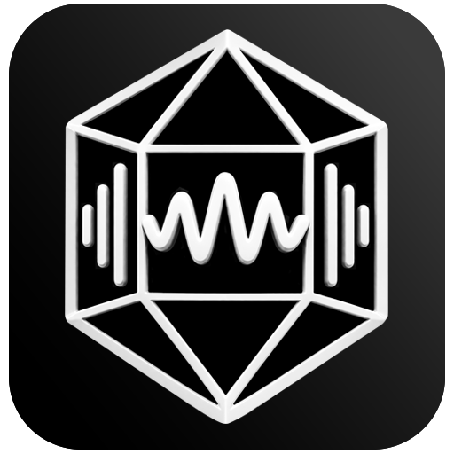

<p align="center">
  
</p>
<h1 align="center">Music Scan Integrity</h1>
<p align="center">
  Проверка музыкальной коллекции на повреждённые файлы. Windows 10/11, офлайн.
</p>

<p align="center">
  <a href="https://github.com/J-udgW05/MusicScan/releases/latest"></a>
  
  <a href="LICENSE.txt"></a>
  
</p>

---

Программа находит файлы, которые физически повреждены и не проигрываются, отличая их
от файлов, которые просто без тегов или выглядят необычно, но на самом деле в порядке.
Работает офлайн, только читает файлы - ничего не удаляет и не переименовывает.

Файл проверяется дважды: декодером - что из него читается звук, и разбором самого
формата — сходятся ли контрольные суммы, записанные внутри файла. Второе даёт точный
ответ там, где первое отвечает лишь «открылось»: обрезанный FLAC декодер прочитает,
а сверка сумм и заявленной длины покажет, что файла не хватает.

Отдельной настройкой включается слежение за порчей: программа запоминает отпечаток
каждого файла и на следующей проверке замечает подмену содержимого при неизменных
размере и дате - так выглядит сбойный диск.

Интерфейс и отчёты - на русском или английском. При первом запуске язык выбирается
по системе, дальше переключается в настройках без перезапуска.

## Установка

В [разделе Releases](../../releases) - установщик `…-setup.exe` и переносимый архив
`…-win-x64.zip`; внутри одно и то же. .NET на компьютере не нужен - всё лежит внутри.

> При первом запуске Windows покажет «Неизвестный издатель»: сборка не подписана
> цифровым сертификатом. Нажмите «Подробнее» → «Выполнить в любом случае».

## Поддерживаемые форматы

WAV, AIFF, FLAC, ALAC, M4A, APE, WV, MP3, AAC, OGG, Opus, WMA, DSF, DFF, а также
трекерные форматы (MIDI, MOD, XM, IT, S3M) и плейлисты M3U, M3U8, PLS, CUE.

## Сборка из исходников

```bash
pwsh tools/fetch-bass.ps1              # библиотеки BASS - отдельно, не в репозитории
dotnet build MusicScanIntegrity.sln -c Release
dotnet run --project src/MusicScanIntegrity.App -c Release
```

Переносимая сборка — `pwsh tools/publish.ps1`, установщик (нужен Inno Setup) —
`pwsh tools/make-setup.ps1`.

## Тесты

```bash
dotnet test
```

## Документация

[`docs/INTERNALS.md`](docs/INTERNALS.md) - как всё устроено внутри: методы проверки,
работа с BASS, движок, отчёты, спорные решения и их обоснование.

## Лицензия

[BSD 3-Clause](LICENSE.txt). Библиотеки BASS этой лицензией не покрыты - бесплатны
только для некоммерческого использования, подробности в
[THIRD-PARTY-NOTICES.md](THIRD-PARTY-NOTICES.md).