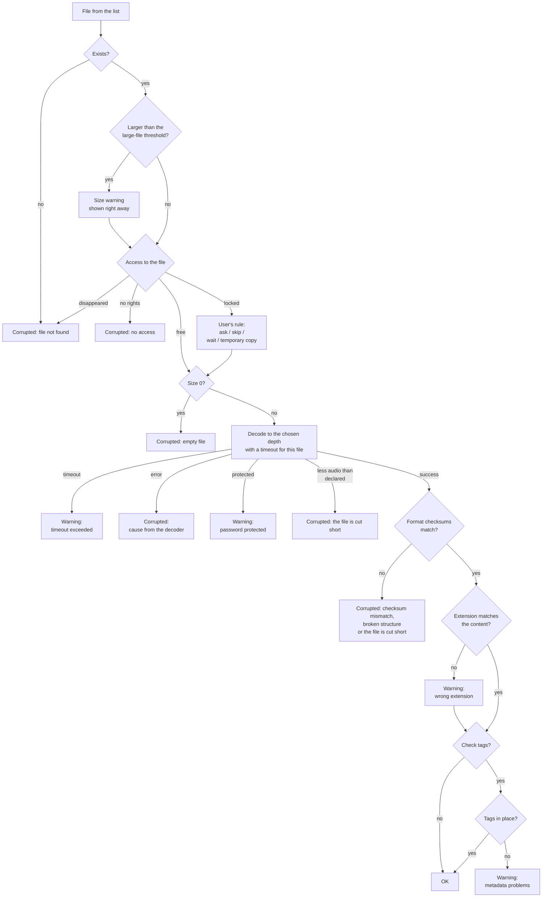
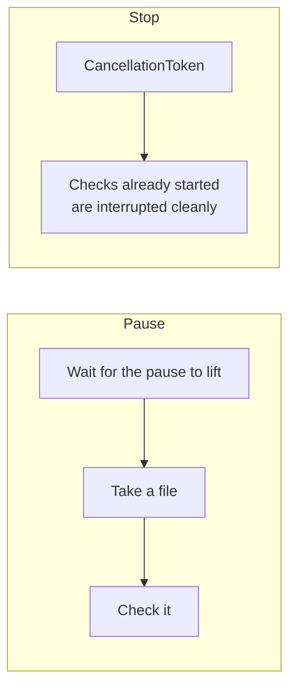

# Music Scan Integrity — how the program works

A technical walkthrough: how the checking is actually put together, which technologies were
chosen and why, and where each decision was made. This document is for someone who opened the
repository and wants to understand the internals without reading all the code.

A surface description and build instructions are in [README.md](../README.md).

---

## Contents

1. [Project map](#1-project-map)
2. [Technologies and why](#2-technologies-and-why)
3. [How a single file is checked](#3-how-a-single-file-is-checked)
4. [Decoding through BASS](#4-decoding-through-bass)
5. [Detecting the format from the content](#5-detecting-the-format-from-the-content)
6. [Reading tags](#6-reading-tags)
7. [Locked files](#7-locked-files)
8. [The scan engine](#8-the-scan-engine)
9. [Playlists](#9-playlists)
10. [Settings](#10-settings)
11. [Reports](#11-reports)
12. [Why the program has no log](#12-why-the-program-has-no-log)
13. [The interface](#13-the-interface)
14. [Working on large collections](#14-working-on-large-collections)
15. [Tests](#15-tests)
16. [Limits of applicability](#16-limits-of-applicability)

---

## 1. Project map

Two projects:

```
MusicScanIntegrity.Core   core: everything that solves the task
MusicScanIntegrity.App    interface: WPF, windows, bindings
```

**The core knows nothing about the interface.** This is not architecture for its own sake but a
condition of testability: the whole checking pipeline, the engine with its parallelism, playlist
parsing and report building are covered by ordinary unit tests, because running them needs
neither a window nor the WPF dispatcher. Everything the core needs from the interface it gets
through interfaces: `ILockedFileDecisionProvider` (ask the user), `IProgress` and events (report
progress).

The core targets `net10.0-windows` — not because of WPF, but because of a single P/Invoke into
`RstrtMgr.dll` (finding the program that holds a locked file).

The core by folder:

| Folder | Responsibility |
|---|---|
| `Models/` | Statuses, cause codes, results, counters, summary |
| `Settings/` | The settings model and its storage |
| `Discovery/` | Walking the folder, the registry of supported extensions |
| `Playlists/` | Parsing M3U/M3U8, PLS, CUE and checking their links |
| `Audio/` | BASS, tag reading, detecting the format from its signature |
| `Locking/` | File access, Restart Manager, temporary copies, the question queue |
| `Scanning/` | Checking one file and the engine with its parallelism |
| `Reporting/` | Export to HTML / CSV / text |

---

## 2. Technologies and why

| Technology | Role | Why |
|---|---|---|
| **.NET 10, C#** | Platform | Fixed by the specification (C#/.NET, Windows 10/11 x64) |
| **BASS** (un4seen) + **ManagedBass** | Audio decoding | Fixed by the specification. Gives one API for about 20 formats through plug-ins and can decode "to nowhere", without playing sound |
| **TagLib#** | Tag reading | Understands ID3v1/v2, Vorbis Comments, APE, MP4 atoms and WMA through one API |
| **WPF + WPF-UI** (lepoco) | Interface | The WPF-UI/Fluent approach was fixed up front. The library provides the Mica backdrop, rounded window corners and the caption buttons; the rest of the styling is our own, following the design reference |
| **CommunityToolkit.Mvvm** | MVVM | The `[ObservableProperty]` and `[RelayCommand]` generators remove the boilerplate around bindings |
| **Microsoft.Extensions.Hosting** | Dependency wiring | The standard .NET way to assemble the program's parts in one place |
| **xUnit** | Tests | — |

One thing to know about BASS: the binaries themselves are **not** part of the repository (the
un4seen licence); `tools/fetch-bass.ps1` downloads them into `native/bass/x64/`, and the build
copies them from there into a `bass\` subfolder next to the executable.

---

## 3. How a single file is checked

The main pipeline is `Scanning/FileChecker.cs`. The order of the steps comes from the original
architecture notes and is numbered in the code with the same figures.



A few points of principle:

**A file can carry several findings at once.** The result holds a list of `CheckIssue`, and the
final status is the most serious of them (`CheckStatusExtensions.Combine`). A file can be both
"large" and "without tags"; both findings land in the description.

**There are exactly four statuses**, as the specification requires: OK, warning, corrupted,
skipped. Situations that the implementation guide calls "errors" (file not found, no access,
decoding error) fall into the red "corrupted" category, but the specific cause is always shown as
text — "file not found" does not look like "broken audio".

**An error on one file does not bring the scan down.** An unexpected exception inside
`CheckAsync` is caught and turned into a result with the `UnexpectedError` code. The only
exception that propagates outwards is `AudioEngineFailureException`: that is a failure of the
decoding machinery itself, after which continuing is pointless.

**A temporary copy is always deleted.** `TempCopy` implements `IAsyncDisposable` and is released
through `await using` in the same method that creates it, whatever the outcome of the check.

---

## 3a. Checking a file by its own means

`Integrity/`. The decoder answers the question "can audio be read", and that is a weak answer:
the beginning of a truncated file reads perfectly well. The formats themselves carry checksums,
and comparing them answers precisely — the file either matches what was encoded or it does not.
No decompression is needed for that, so the check is limited by disk speed: 20 MB of FLAC is
parsed in 120 ms, a 1.3 MB MP3 faster than the timer can tick.

| Format | What is checked | Strength of the verdict |
|---|---|---|
| FLAC | header CRC-8 and CRC-16 of every frame, the sample count from `STREAMINFO` | checksums verified |
| Ogg (Vorbis, Opus) | CRC-32 of every page, page number order, the end-of-stream flag | checksums verified |
| MP3 | the frame chain by declared lengths, CRC-16 of protected frames, the frame count from Xing/Info | checksums where they exist |
| MP4, M4A | the box chain, the mandatory `ftyp`, `moov`, `mdat` | structure |
| WAV, AIFF | the chunk chain, the `data` length against the file size | structure |
| WavPack, APE | the block chain, declared lengths adding up | structure |

**Why WavPack and APE get structure only.** Their checksums are computed over *decompressed*
samples: verifying them would mean writing a decompressor of our own. MP3 generally has no
per-frame checksums at all — they appear only if the file was encoded "with protection". The
program does not pretend to have checked more than it did: the details say exactly that —
"checksums matched" or "structure intact". An honest consequence follows: a single corrupted byte
in an unprotected MP3 is found by nothing short of listening.

**How a FLAC frame boundary is found.** It is written down nowhere — it only shows up as the
start of the next frame. The parsing goes like this: the header is read, then the next signature
is searched for, and on every guess about the boundary the CRC-16 is verified. A matching
checksum is the proof that the boundary was found correctly: a false signature inside compressed
data will not produce a matching sum.

That technique has a loophole which had to be closed separately. A CRC-16 computed over a frame
together with its own checksum equals zero, and zeros appended at the end do not change it — so
garbage in the tail passed for a continuation of the last frame. Limiting the frame to the length
declared in `STREAMINFO` closes the loophole.

**The format is determined from the content.** The parser is chosen by the signature at the start
of the data, not by the extension: a file named `.mp3` with FLAC data inside must be checked by
FLAC rules, otherwise the verdict would be about damage that does not exist.

**Tags around the audio are removed before parsing.** `ContainerBounds` finds once where the ID3v2
ends at the start and where the ID3v1 and APEv2 begin at the end, and every parser then reads
between those boundaries. It cannot be done any other way: a parser starting at byte zero would
take the tag at the start for a broken header and the tag at the end for garbage after the last
frame. Both conclusions are false alarms on a healthy file, and that is the worst thing the
program can say about a healthy collection. The error offset is still counted from the start of
the file rather than the start of the stream: a person will look for the damage in the file.

The price is theoretical: the last 128 bytes of a file that happen to begin with `TAG` will be
taken for a tag and left unchecked. The odds of that coincidence are one in sixteen million, and
they are outweighed by how common tags are in real collections.

**An unfilled length in WAV.** Zero and `0xFFFFFFFF` in the RIFF size field mean "length unknown"
— that is how the header is written by something recording audio into a stream that cannot seek
back. Such a file is intact and is not treated as truncated: the chunk chain is checked against
the real file size.

---

## 4. Decoding through BASS

`Audio/BassAudioProbe.cs`. The idea of the check is not "the file exists and the extension is
right" but "the decoder really did read audio out of it".

**The reading depth** is set in the settings and passed to the probe as `DecodeScope`:

| Depth | What is read | What it costs |
|---|---|---|
| Quick | the first two seconds | as before: a fraction of a second per file |
| Sampled (default) | five 1.5-second windows: the start, the end and three points in the middle | a 1.5 GB folder, checksums included, takes about ten seconds |
| Full | the whole file | longer by the factor by which the track exceeds eight seconds |

Sampled is a trade-off: damage in the middle of a track is caught, but a few seconds are read
instead of the whole file. The last window is pressed against the very end — incompletely
downloaded files break off exactly there, and that is the first place worth looking. A file
shorter than five windows is read whole: that is both faster and more accurate.

**Truncation detected from the decoder's data.** The declared duration comes from the header
(`BASS_ChannelGetLength`), the read duration from the walk itself. If noticeably less was read,
the file is unfinished. A one-second tolerance is mandatory: headers round the duration, and
quibbling over tenths would mean declaring healthy files corrupted. The technique does not work
for WAV — BASS takes the length of such a file from its size on disk rather than from the header;
there truncation is caught by the structure check.

**How it is done:**

1. **Initialised once at start-up.** `Bass.Init(0, ...)` — device 0 in BASS means "no sound": the
   sound card is not taken and nothing is played. The background buffer-update threads are off
   (`UpdateThreads = 0`, `UpdatePeriod = 0`) — there is no playback, and on a large collection
   this saves a noticeable amount of CPU.

2. **Loading the plug-ins.** Every `bass*.dll` except `bass.dll` itself is taken from the `bass\`
   folder and passed to `Bass.PluginLoad`. Anything that fails to load is not an error: it means
   that format cannot be checked, and the program says so honestly. The library search path is
   added through `SetDllDirectory`, otherwise `LoadLibrary` would look for `bass.dll` only next to
   the executable and in the system folders.

3. **Opening the stream in decode mode.** `BassFlags.Decode` means "do not play, only decode".
   Tracker formats (MOD, XM, IT, S3M) are opened through `Bass.MusicLoad`, the rest through
   `Bass.CreateStream`: in BASS these are different functions.

4. **Reading the first two seconds.** `Bass.ChannelSeconds2Bytes` converts seconds into bytes,
   then the data is read in 64 KB chunks. Cancellation is checked between chunks — that is how
   both the Stop button and the per-file timeout work.

5. **Interpreting the result.** The BASS error code is translated into one of the outcomes:

| BASS error | Outcome | Status |
|---|---|---|
| `WmaLicense`, `WmaAccesDenied`, `WmaIndividual` | password protected | Warning |
| `Empty` | empty file | Corrupted |
| `FileOpen`, `FileFormat`, `Codec`, `Unstreamable`… | could not start decoding | Corrupted |
| an error while reading data | reading the audio data broke off | Corrupted |
| `Memory`, `Init`, `NotAvailable` | failure of the machinery itself | The scan stops |
| `Ended` before 2 s | normal: a short track | OK |

Every error has human wording next to it (`BassAudioProbe.Describe`): in the interface the user
sees "the file format was not recognised", not `BASS_ERROR_FILEFORM`. The technical code is kept
in a separate field and shown as the second line in the details.

**Why two seconds exactly.** The specification asks for "the first one or two seconds". That is
enough to tell a broken file from a healthy one: a damaged header or a truncated stream shows up
immediately. Decoding a collection of hundreds of thousands of files in full would take hours and
would not give a fundamentally different result.

**The `IAudioProbe` abstraction** exists for the tests: the scan engine and the per-file pipeline
are covered by tests with a stand-in decoder that answers according to the test's script — with no
native libraries and no real audio files.

### 4.1. What the samples themselves show

`Audio/AudioStats.cs`. The samples pass through the decoder's buffer anyway, so loudness,
clipping, DC offset and drops into silence come for free, without a second read from disk — the
counters are filled on the fly, in a single pass.

| Finding | Rule | Why this way |
|---|---|---|
| No audio | the peak level stays below −60 dB across everything read | the file reads, but there is nothing to listen to |
| Drop into silence | silence longer than a second **inside** a sounding stretch, with average loudness above 0.01 | a piece lost while copying |
| Clipping | more than 0.1 % of samples at full scale | a sign of a bad loudness conversion |
| DC offset | a constant component above 0.02 | a sign of bad digitising |

Three decisions without which these checks would do more harm than good:

**Silence at the start and at the end does not count as a drop.** Nearly every track has an
intro and a fade-out. A drop is counted only when there was sound, it disappeared and came back —
the accumulator records silence only after it has ended, and only if sound came before it.

**Silence is not reported at quick depth.** Only the first two seconds were read — and in a track
with a long intro they are supposed to be quiet. The finding appears only at sampled and full
depth, when more than the opening was read.

**Clipping detection is off by default.** In modern masters the samples hit full scale all the
time: that is their normal state, not a defect. Enabled by default, the check would warn about
half the collection and devalue the rest.

### 4.2. Suspected transcoding

`Analysis/Fft.cs` and `Analysis/SpectrumAnalyzer.cs`. Lossy compression cuts the top of the
spectrum: 320 kbit/s at roughly 20 kHz, 192 at about 19, 128 at about 16. So a "lossless" file
whose audio stops at 15 kHz was almost certainly built from an MP3. The check answers exactly
that question: how far up the file actually has audio.

It computes its own Fourier transform — fifty lines instead of a package, which keeps the build
portable and lets the algorithm be verified against signals with a known answer. Chunks of 4096
samples, a Hann window, up to 64 chunks — that is enough; beyond it the measurement does not
change.

**The cut-off is taken from the widest-band chunk, not from the average.** That is not a detail
but a fix for a false alarm caught on real files: averaging the spectrum made a symphony
recording suspicious, because it has more quiet passages than loud ones and the average showed
missing highs where they are present in the climaxes. The question is not "are there many highs"
but "do they occur at all": a file built from compressed audio never has them. After the fix the
same five files pass cleanly, while a signal limited to 15 kHz is still flagged.

The rule fires only when everything lines up: a lossless format, a sample rate of at least
44.1 kHz, a recording that is not quiet, at least eight chunks gathered, and a cut-off below
17.5 kHz. For compressed formats the condition differs: a bitrate from 256 kbit/s with a cut-off
below 16.5 kHz.

**This is a suspicion, not a verdict.** Old recordings, voice tracks and deliberately narrow-band
material have no high frequencies without any transcoding. That is why the status is yellow, the
wording begins with "looks like", and the technical line shows the measured figure — so a person
can look for themselves.

---

## 5. Detecting the format from the content

`Audio/ContentTypeSniffer.cs`. Needed for the "extension does not match the content" finding: an
MP3 that is really a FLAC is a common trace of a botched conversion.

The first 64 bytes are read and compared against signatures:

| Signature | Format |
|---|---|
| `fLaC` | FLAC |
| `OggS` + `OpusHead` / `vorbis` / `\x7fFLAC` | OPUS / OGG / FLAC-in-Ogg |
| `RIFF`…`WAVE` | WAV |
| `FORM`…`AIFF`/`AIFC` | AIFF |
| `MAC `, `wvpk`, `MThd`, `DSD `, `FRM8`, `MPCK`, `TTA1` | APE, WV, MIDI, DSF, DFF, MPC, TTA |
| `….ftyp` + brand | M4A / MP4 |
| GUID `30 26 B2 75 8E 66 CF 11` | WMA (ASF) |
| `ID3` or the sync marker `0xFF 0xEx` | MP3 or AAC (ADTS) |
| `SCRM` at offset 44, `IMPM`, `Extended Module: ` | S3M, IT, XM |

Comparing the extension with the format found (`Matches`) is deliberately lenient: `.m4a` /
`.mp4` / `.alac` / `.aac` are one container, `.ogg` / `.opus` likewise, `.mid` and `.midi` are the
same thing. Only a genuine mismatch counts as a conflict.

If the signature is unknown, that is **no reason to complain**: the method returns `null` and no
finding appears. A false alarm here is worse than a miss.

Priority goes to the format the decoder itself reported (`ChannelInfo.ChannelType`); the
signature is read only when the decoder did not name a format.

---

## 6. Reading tags

`Audio/TagLibMetadataReader.cs`. Three main tags are checked: title, artist, album.

The key decision, required outright by the specification: **missing tags are not damage**. A huge
amount of perfectly good music is stored without tags; marking such files on a par with broken
ones would make the user stop trusting the results. Therefore:

- tag checking is **off by default** — it is an additional, optional check;
- its result is the `MetadataProblem` code at warning severity, labelled in the table as "No
  tags", with a description that says outright "This is not file damage";
- TagLib exceptions are separated: `UnsupportedFormatException` (the container is not supported),
  `CorruptFileException` (the tags are damaged) and I/O errors produce different technical
  explanations but the same mild status.

### 6.1. Mojibake in tags

`Analysis/TextIntegrity.cs`. The bane of old Russian collections: Cyrillic written in CP1251 and
read through a Western European table — "Привет" turns into "Ïðèâåò". Or the other way round:
UTF-8 read byte by byte, producing "Привет". The file is intact, while the captions in the
player are unreadable.

Three rules, each with its own trace:

- the replacement character `�` — the system itself could not read something;
- "Ð", "Ñ", "Ã", "Â" together with bytes from the control part of the table — UTF-8 read byte by
  byte;
- more than six tenths of the letters are Latin with diacritics, and the text is longer than three
  letters: that is what Cyrillic read through the wrong table looks like.

The last rule is the edge where the heuristic can be wrong, so the share is taken with a margin:
"Café", "Motörhead", "Björk" and "Ça va" do not count as mojibake — a single accented letter in
ordinary text does no harm.

Verified on real files: for copies of the same track tagged "Песня о городе / Гражданская оборона
/ Русское поле" — one in the correct encoding and one broken — the first passes cleanly and the
second gets a warning.

### 6.2. Cue sheet marks

`Playlists/CuePlaylistParser.cs` parses not only the `FILE` lines but also the `TRACK` and `INDEX`
marks: the time is written as "minutes:seconds:frames", where a frame is one seventy-fifth of a
second. A mark past the end of the file means the cue and the audio come from different releases:
the disc was laid out for one file while a different one lies next to it. In that case a player
silently shows tracks that do not exist.

There is something to compare against: the duration of every file is left over from the main check
(`FileCheckResult.DurationSeconds`) and passed into the playlist parsing. The tolerance is one
second: the last track sometimes starts right at the end, and the duration from the header is
rounded.

### 6.3. Inspecting the collection: albums and duplicates

`Analysis/CollectionInspector.cs`. The findings of this inspection belong to a folder or to a pair
of files rather than to a single file, so they are kept in their own type (`CollectionFinding`)
instead of the file's finding list: a gap in the numbering is a property of the album, and
pinning it on a randomly chosen track would be untrue.

What is looked for:

| Finding | Condition | Caveat |
|---|---|---|
| Gaps in the numbering | seven tenths of the files in the folder have numbers and something is missing from the run 1…max | a folder without numbers is not treated as having gaps |
| Mixed formats | more than one format in a single folder | this usually happens when part of an album was downloaded differently |
| Mixed albums | more than one value of the "album" tag | compilations fall under this rule deservedly |
| No cover art | no file has an image in its tags and the folder has no `cover`, `front` or `folder` | if the folder cannot be read, no finding is raised |
| Duplicate | artist, title and duration match to within a second | tags alone are not enough: a live and a studio version share the title |

It is computed from results that already exist; the files are not read a second time. The
inspection lives in the application rather than the engine: the engine delivers results in batches
and does not keep them all, while the list of finished results is on the Results tab anyway.

What it finds is shown as a separate card on the Report tab and goes into all three report
formats.

---

## 7. Locked files

The subtlest part is the `Locking/` folder.

### 7.1. What counts as "locked"

`FileAccessProbe.Check` tries to open the file for reading with
`FileShare.ReadWrite | FileShare.Delete` sharing and interprets the result:

| What happened | State |
|---|---|
| It opened | available |
| `FileNotFoundException` / `DirectoryNotFoundException` | not found |
| `UnauthorizedAccessException` | no rights |
| `IOException` with code 32 or 33 (`ERROR_SHARING_VIOLATION`, `ERROR_LOCK_VIOLATION`) | locked |
| other `IOException` | no access |

**A deliberate departure from the letter of the specification.** The architecture notes speak of
"exclusive read access", but opening with `FileShare.None` would declare locked any file that
another program keeps open even for reading — a track open in a player, for instance. Such a file
decodes perfectly well, and bothering the user with a question would be wrong. So only a file that
genuinely will not open for reading counts as locked.

### 7.2. Who holds the file

`RestartManagerLockDetector` uses the Restart Manager (`RstrtMgr.dll`) — the most reliable
documented way on Windows: `RmStartSession` → `RmRegisterResources` → `RmGetList` (in two calls:
first to learn the size, then to get the data).

The implementation guide requires outright: **do not present unreliable information**. So on any
API error `LockOwnerResult.Unknown` is returned and the user sees an honest "The owning program
could not be determined" rather than a list of random processes that might lead them to close the
wrong one.

The program never closes anyone else's process by itself. The "close the owner" option is offered
in the question only if the owner was determined reliably **and** the user turned on the
corresponding setting (off by default).

### 7.3. Questions are asked one at a time

The scan runs in parallel, so several files can turn out to be locked at once.
`LockedFileQuestionQueue` lines the questions up through `SemaphoreSlim(1, 1)`:

- while the user is answering one question, the others wait;
- the "do the same for all" checkbox is remembered, and the queue answers for all the remaining
  files instantly, without showing a question;
- "Stop the scan" chosen from the question is remembered too: the other waiting files get the
  answer "stop" instead of hanging;
- the state is re-checked **after** waiting in the queue — while the file stood in line, the user
  may already have answered "for all".

In the interface the question is shown as a card on the Scan tab rather than in a separate window:
it does not cover the progress and does not block the queue. If the user is looking at another
tab, the program switches them to Scan.

### 7.4. Temporary copies

`TempCopyManager` puts the copies into `%TEMP%\MusicScanIntegrity\` under random names with the
`.tmp` extension.

- `TempCopy` implements `IAsyncDisposable`; the calling code uses `await using`, so the copy is
  deleted whatever the outcome — success, error or cancellation.
- If creating the copy broke off, the unfinished file is deleted immediately.
- At start-up `CleanupOrphans()` clears out copies left over from a previous run that ended
  abnormally.

An honest limitation: if the owner holds the file **with no sharing at all**, it cannot be copied
either. The program does not pretend to have checked the file — it reports "the temporary copy
could not be made".

---

## 8. The scan engine

`Scanning/ScanEngine.cs`.

### 8.1. Parallelism

`Parallel.ForEachAsync` with `MaxDegreeOfParallelism` taken from the settings. "Auto" is
`Math.Clamp(Environment.ProcessorCount, 1, 8)`: by core count, but no more than eight. The upper
limit is not arbitrary — the check is bound by the disk, and adding threads beyond that only
increases contention for it.

**The kind of drive matters more than the core count.** `Discovery/StorageTypeDetector.cs` asks
the disk driver whether seeking costs time (`IOCTL_STORAGE_QUERY_PROPERTY`, the
`StorageDeviceSeekPenaltyProperty` property). On a hard disk eight parallel reads are eight queues
to a single head: it thrashes between tracks and the scan runs slower than it would with two
threads. So on such a disk parallelism is limited to two, while on a solid-state drive it stays
as it was.

If the kind cannot be established — a network share, a virtual disk, access denied — nothing is
limited: guessing does harm. The answer of this check affects only the thread count, so any
surprise in it means "I do not know" rather than a stop.

The thread count shown in the report and in the line under the button is the one the engine
actually took, not the one the settings asked for.

Verified on this machine: scanning a folder on a hard disk (WD10EZEX) runs in two threads, on a
flash drive in eight; the drive kinds were cross-checked with `Get-PhysicalDisk`.

### 8.2. Pause and stop

These are different mechanisms, and the difference matters:



- **Pause** is a `PauseTokenSource` over `ManualResetEventSlim`. The wait sits **before a new file
  is taken**, so checks already under way run through to a result while new ones are not started.
- **Stop** is a `CancellationTokenSource`. The token reaches the data reads from BASS, the wait
  for a locked file to be released and the question queue.
- **`Stop()` lifts the pause before cancelling.** Without that, threads waiting for the pause to
  lift would never see the cancellation request and would hang for good. The specification
  requires Stop to work at any moment, including while paused; there is a separate test for it.

Results already gathered are kept on a stop and stay available — the summary is flagged with
`WasStopped`, and that is visible in the report.

### 8.3. The per-file timeout

A separate `CancellationTokenSource.CreateLinkedTokenSource` with `CancelAfter` for every file. If
that is what fired (rather than the overall stop), the file gets a "timeout exceeded" warning and
the rest of the scan continues.

### 8.4. Results in batches

Raising an event for every single result on a collection of hundreds of thousands of files is a
sure way to freeze the interface. So:

- results are put into a `ConcurrentQueue`;
- a background loop on a `PeriodicTimer` hands over what has accumulated every **200 ms**, in
  batches of no more than **250** per event;
- the queue is drained **completely** — the loop repeats while anything is left in it. (An early
  version handed over one batch per tick and lost results; there is a test for that now.)

The counters are maintained under a lock, separately from the queue, so that progress updates even
when a batch has not been handed over yet.

### 8.5. Statuses for the summary

The status of every file goes into a `ConcurrentDictionary` **as soon as the result arrives**, not
when a batch is handed over. Otherwise the per-folder summary and the playlist check would see
only the last batch.

### 8.6. A critical failure

An `AudioEngineFailureException` from the file pipeline stops the scan but **does not bring the
program down**: the engine moves to the `Failed` state, everything gathered is kept, the
`CriticalFailure` text goes into the summary, and the interface shows an understandable message.

---

## 9. Playlists

`Playlists/`. Playlists have a different job: not to decode, but to check that the paths inside
lead to files that exist.

Three parsers behind a common `IPlaylistParser` interface:

| Format | What is parsed |
|---|---|
| **M3U / M3U8** | A line-by-line list; lines starting with `#` are directives, not paths |
| **PLS** | INI-like; only the `FileN` keys are taken, the order is restored from the number |
| **CUE** | `FILE "name" WAVE` directives; the `TRACK`/`INDEX` entries are positions inside the same file, not separate paths |

**Resolving paths** (`ResolvePath`):

- relative paths are resolved **against the playlist's own folder**, not the program's working
  directory;
- `/` is converted to `\` — playlists often arrive from other systems;
- links with a scheme (`http://`, `https://`) are not treated as paths: that is a network stream,
  there is nothing to check on disk;
- a line that does not look like a path at all does not break the parsing — the entry is simply
  counted as missing.

**The encoding** is determined in order: BOM (UTF-8, UTF-16 LE/BE) → extension (`.m3u8` is always
UTF-8) → a strict UTF-8 attempt → the system ANSI code page. The last step is needed for old `.m3u`
and `.pls` files with Cyrillic in their paths.

That last step depends on the machine: the "system ANSI code page" is the user's Windows code page
(1251 on a Russian system, 1252 on a Western European one). Ordinary players do the same: the
encoding is not recorded in the file and there is no other way to guess it. The practical
consequence is that a playlist with Cyrillic paths opened on a system with a different code page
will not resolve. The test for this behaviour picks a file name to suit the current machine's code
page, otherwise it would fail on any build agent with a different locale.

**One file, one status.** If a path from a playlist matches a file already checked during the
ordinary scan, its status is taken from the main check (`PlaylistEntry.KnownStatus`) rather than
computed again. That is why playlists are checked **after** the files — by then the status
dictionary is filled.

---

## 10. Settings

`Settings/JsonSettingsService.cs`. Ordinary JSON, readable and editable by hand.

**Where the file lives.** First `config\settings.json` next to the program is tried — this is a
portable build, it must not write anything into the registry. The folder's suitability is checked
by actually writing a probe file; if writing is not possible (Program Files, read-only media), the
settings go to `%APPDATA%\MusicScanIntegrity\settings.json`.

**Writing is atomic**: first into a temporary file, then `File.Move(overwrite: true)`. An
interrupted write will not leave the user with a half-written, and therefore unreadable, config.

**A damaged file does not prevent start-up.** A parsing error is not propagated: the defaults are
used, the spoiled file is kept as `settings.json.corrupted` (so it can be inspected), and a new
valid one is written.

**Values are clamped into range** (`Sanitize`): the file is edited by hand, and it may end up with
a timeout of a million seconds or zero threads. Extensions are brought to a single form (`flac`,
`.FLAC`, `*.mpc` → `.flac`, `.mpc`).

Disabled formats are stored as a **list of exceptions** rather than a list of enabled ones: that
way newly supported formats work for the user automatically, without editing their config.

---

## 10a. Scan history and silent corruption

`History/`. Off by default; enabled with the "track file decay" setting.

The question all of this was built for: the content of a file changed while its size and date
stayed the same. Neither the decoder nor the format parsing will see that — they check the file as
it is now, and if a failing disk swapped the bytes before the very first scan, the "damage" will
look like an ordinary file. The substitution can only be noticed by comparing against last time.

**The fingerprint is XxHash3, not SHA-256.** Cryptographic strength is not needed here; the only
requirement is to notice that the content changed. The difference in speed is noticeable, and on a
collection of a hundred gigabytes the check would be bound by the processor rather than the disk.

**The database is SQLite in `data/history.db` next to the program.** Portability is preserved: the
folder can still be copied anywhere. WAL mode was chosen because the scan writes often and reads
rarely, and the database survives an abnormal shutdown of the program.

**What tracking gives:**

- silent corruption: the size and date match but the fingerprint differs — a separate
  `SilentCorruption` code with the "corrupted" status;
- skipping unchanged files: if the fingerprint matches and the previous check succeeded, decoding
  and structure parsing are not repeated. The disk is still read in full — otherwise the
  fingerprint could not be computed — but the processor-bound part of the work falls away.

Skipping is done only for files that were fine last time. For a damaged one the cause lives in the
findings rather than the database, and a "corrupted" status with no explanation would be worse
than checking again.

---

## 11. Reports

`Reporting/`. Three exporters behind a common `IReportExporter` interface, all writing to a
stream asynchronously — saving does not block the interface.

| Format | Particulars |
|---|---|
| **HTML** | The same colour tokens as in the program, dark theme included; the palette follows the theme chosen in the application. A status is a glyph plus a word, never colour alone |
| **CSV** | `;` as the separator, UTF-8 with a BOM, a `sep=;` directive on the first line — Russian Excel opens such a file correctly without the import dance |
| **Text** | Grouped by status: corrupted files first, since that is what the report is opened for |

**Escaping** is a concern of its own, spelled out by the specification:

- HTML: **all** user content goes through `WebUtility.HtmlEncode`. A file named
  `<script>alert("x")</script>.mp3` lands in the report as text and does not break the markup.
  There are tests for this, including a check that the angle brackets balance.
- CSV: escaping per RFC 4180 — a cell is quoted if it contains the separator, a quote or a line
  break; inner quotes are doubled.

The file is written through a `.part` name and renamed when finished: an export that breaks off
will not overwrite the previous report with a half-written one.

Every report carries a summary (how many files in total, how many in each status, how long the
scan took) and an explicit note if the scan was stopped — otherwise the figures would mislead.

---

## 12. Why the program has no log

There is no log at all: no tab, no files on disk, no logging library among the dependencies. This
is a decision by the program's owner, taken after the first version — the original requirements
asked for a log.

What stands in its place:

- **the user sees the errors**, not a file: a dialog with human wording and a separate "Technical
  cause" block holding the exception type and its message;
- **per-file problems** land in the results and in the report; every file has a finding code and
  a description;
- **a crash on a background thread** shows a window with the message before the process ends.

What is gone: any trace on disk after the program closes. If a problem has to be investigated on
someone else's machine, it will have to be reproduced live.

---

## 13. The interface

### 13.1. Where the text lives

All user-facing text lives in the string catalogue `Core/Resources/Strings.resx` (Russian, the
neutral language) and `Strings.en.resx` (English). The core reads it through the generated
`Strings` class, and the markup through the `{svc:T Key}` markup extension, so switching the
language re-reads every binding at once without a restart.

| What to edit | Where |
|---|---|
| Any caption, heading, button, message or report column | `Core/Resources/Strings.resx` and `Strings.en.resx` |
| Which key a screen uses | `src/MusicScanIntegrity.App/Views/*.xaml` |
| Which key a dialog uses: help, about, first run, export, scan results | `src/MusicScanIntegrity.App/Views/Dialogs/*.xaml` |
| Questions and messages the program raises while working | `ViewModels/MainViewModel.cs`, `ViewModels/SettingsViewModel.cs` |
| Names of statuses, depths and report formats in drop-downs | `Converters/Converters.cs` |
| Wording of file findings ("the file reads, but there is no audio") | `Core/Scanning/FileChecker.cs`, `Core/Models/CheckIssue.cs` |
| Reasons the decoder refused | `Core/Audio/BassAudioProbe.cs`, the `Describe` method |
| What the format validators say about damage | `Core/Integrity/*Validator.cs` |
| Report headings and columns | `Core/Reporting/*.cs` |
| Numbers, sizes and agreeing nouns ("5 файлов" against "2 файла") | `Core/Common/Format.cs` |

Text for the user is written in human terms: what happened and what to do about it. Technical
particulars go into a separate `TechnicalDetail` field, not into the main message.

### 13.2. MVVM

`MainViewModel` is the orchestrator: choosing the folder, starting and stopping the scan,
reacting to engine events, exporting. Tabs with logic of their own are split into separate models
(`ResultsViewModel`, `ReportViewModel`, `SettingsViewModel`).

Engine events arrive on background threads, so every handler returns to the interface thread
through `Dispatcher.BeginInvoke`.

**Breaking the dependency cycle.** The engine asks about locked files, and it is the main window
that asks the user — a direct dependency would produce a cycle in the container.
`LockedFileDecisionRelay` breaks it: the engine receives the relay when it is created, and
`MainViewModel` puts itself into the relay in its own constructor.

**A rake already stepped on:** the dependency injection container passes an **empty collection**
instead of the default value for an `IEnumerable<T>? = null` parameter. Because of that
`PlaylistService` and `ReportService` were once left with no parsers and no exporters at all —
silently. An empty set now counts as "not supplied", the composition is registered explicitly, and
there are tests for it.

### 13.3. Themes

The colour tokens of both themes live in `Resources/Tokens.Light.xaml` and `Tokens.Dark.xaml`
under identical keys. `ThemeService` swaps the whole dictionary inside
`Application.Resources.MergedDictionaries`; every brush in the markup is taken through
`DynamicResource`, so switching is instant and needs no restart.

With "follow the system" chosen, the service subscribes to `SystemEvents.UserPreferenceChanged`
and reads the system setting from the registry (`…\Themes\Personalize\AppsUseLightTheme`).

User colours for the statuses are laid over the theme dictionary — the brushes `Brush.Ok`,
`Brush.Err`, `Brush.Warn`, `Brush.Skip` are replaced along with the label backgrounds
`Brush.OkBg`, `Brush.ErrBg`, `Brush.WarnBg`, `Brush.SkipBg`. The background is not taken from the
theme but derived from the colour itself — otherwise a purple "OK" chosen by the user would sit on
a green background and the label would look broken rather than recoloured. The mixing ratios were
matched against the existing tokens: 0.10 of the colour over white for the light theme, 0.13 over
`#1C1C1E` for the dark one.

### 13.1a. Where the program keeps its files

The settings and the history database live next to the program — it is portable, the folder can be
copied and carried away. But it can also be installed, and an ordinary user is not allowed to
write into Program Files. Then everything moves into the profile: the settings into `%APPDATA%`,
the database into `%LOCALAPPDATA%`.

The two parts of the profile differ for a reason. The settings were in the roaming part from the
start, and moving them would lose them for everyone already using the program. The database grows
to tens of megabytes, and there is no point dragging it between machines with the profile.

Availability is checked by writing a probe file rather than by inspecting permissions: there are
many reasons for a refusal — Program Files, read-only media, a security policy — and listing them
is pointless. Only one answer matters: did it work or not.

### 13.2a. Why rounded corners look stepped

The complaint about "unsmoothed" edges is about geometry, not anti-aliasing. Verified by
measurement: a `Border` with a corner radius, a `Rectangle` with radii and a `Path` with explicit
geometry produce byte-for-byte the same result, and `SnapsToDevicePixels` and `UseLayoutRounding`
do not change a single pixel. Anti-aliasing does work — two dozen intermediate shades can be
counted on a button corner.

What is actually visible is the size of the jump. On a six-pixel corner radius the arc covers a
handful of pixels, and the transition from a dark background straight to a bright fill happens in
one step. The eye reads that step as a staircase, however much it is smoothed.

The cure is colour, not rendering: an edge in an intermediate tone halves the jump. The direction
of the mixing matters more than its amount and differs between themes — in the dark theme the edge
is darker than the fill, in the light one lighter. Getting them the wrong way round makes things
worse: darkening the edge in the light theme raises the largest jump from 140 to 171. A share of
30 % of the distance between the fill and the background brings the largest jump down from 114 to
79 in the dark theme and from 146 to 104 in the light one. More than that keeps improving the
figure, but the edge starts reading as a separate ring around the button rather than its border.

### 13.3a. The Mica backdrop and animations

Both settings have three values: on, off and "not chosen yet". The difference between the second
and the third is fundamental. On the first run it is Windows that should be consulted — the
program must open with the styling the person is used to; once they have switched something
themselves, there is nothing left to consult, the decision is made. Checking for false instead of
checking for "not set" would produce the classic bug: a backdrop turned off would come back on
every start-up. Empty values are resolved once at start-up and written to the file straight away.

What is read from the system: "Personalisation → Colours → Transparency effects" from the registry
(`…\Themes\Personalize\EnableTransparency`) and "Accessibility → Visual effects → Animation
effects" through `SystemParameters.ClientAreaAnimation` — a wrapper over
`SPI_GETCLIENTAREAANIMATION`. Windows has no separate Mica switch; the backdrop follows the general
transparency switch.

The **intention** is stored, while what is possible is drawn. Windows 10 has no backdrop at all,
but that does not turn the setting off: otherwise, after moving to Windows 11, it would stay off
for no reason. The toggle in the settings is disabled in that case and says honestly why.

**The backdrop is not visible through an opaque window.** `WindowBackdrop.ApplyBackdrop` only sets
the DWM attribute and does not touch the background — verified. So with the backdrop on
`ThemeService` replaces the surface brushes: the page background goes fully transparent, the title
bar and the toolbar get a light tint, and the cards a dense one. The opacity shares differ between
the dark and light themes: a light tint on a light background is nearly invisible, and a card
would have to be searched for.

The window's `WindowBackdropType` property applies the backdrop **only when the value changes**.
It cannot be relied on: WPF-UI touches the backdrop when the theme changes, and assigning the same
value again fixes nothing — the window keeps someone else's backdrop. So the backdrop is also
applied explicitly, every time.

**Why animations are started from code rather than by storyboards in the markup.** A trigger in a
template keeps its storyboard frozen — otherwise it could not be shared between all the identical
elements. A frozen tree accepts neither `DynamicResource` nor bindings, and parsing such markup
simply fails. Verified, not assumed. So the duration in a template cannot be changed on the fly,
and the animation switch has to work where the condition is evaluated at the moment

of start-up — in code (`Controls/Motion.cs`).

The one storyboard that does live in the markup is the travel of the toggle knob. It has two
frozen branches, one with a duration and one with zero, and a multi-condition trigger on the
attached `Motion.Enabled` property chooses between them. The property is inherited down the tree,
so it is set once on the window. A dialog, however, is a separate window and its owner is not its
logical parent: the inheritance does not reach it, so the value is set on every window as it
loads.

The settings screen hides the tabs rather than covering them with its background. With a
transparent background there is nothing to cover with: the Scan tab would show through the
settings.

A colour is picked in a window of its own: a saturation and brightness field, a hue strip, ready
shades and a code box. The system dialog did not fit — it lives in Windows Forms, and dragging
that into a WPF application for the sake of one window would mean a dialog that looks foreign. The
code box is not decoration either: an exact value cannot be caught by dragging across a gradient,
and only the code lets a colour be typed on the keyboard.

The calculations — parsing `#RRGGBB`, converting RGB↔HSV, mixing into a surface — live not next to
the window but in `Core/Common/ColorMath.cs`. The reason is practical: a window cannot be dragged
across with a mouse in an automated check, while core functions are covered by tests
(`ColorMathTests`). What stays in the window is turning cursor coordinates into shares —
`ColorMath.Share`.

### 13.4. The program mark

The source of the mark is `src/MusicScanIntegrity.App/Assets/icon.png`: a 512-pixel square,
transparent background, a light drawing on a dark rounded tile. `Assets/app.ico` is built from it.

The padding at build time is 2 %, which is less than Windows recommends. That recommendation is
about glyph icons: a drawing without a tile needs room to breathe. Our mark is its own tile and is
meant to fill the whole square. At six per cent it came out noticeably smaller than its neighbours
on the taskbar, and the drawing lost a couple of pixels — at 24 pixels that shows. The two per cent
are left only so that the shadow does not touch the edge.

`Assets/app.ico` holds ten frames — 16, 20, 24, 32, 40, 48, 64, 96, 128 and 256
pixels. Up to 128 the frames are stored as BMP, 256 as PNG: that is how both Windows and Explorer
read them. The executable's icon comes from this file, and with it the taskbar, Explorer and the
window switcher.

Every frame is scaled down from the drawing itself — none is redrawn. Small sizes used to be
assembled from simplified shapes, but the current mark has lines thick enough to survive scaling,
and the substitution only pulled the silhouette away from the original.

Scaling is computed **in linear light**, and that is the main thing that determines how the small
frames look. GDI+ averages pixels as they are, in sRGB, and sRGB is not brightness but a power
representation of it. A white line covering a quarter of a pixel darkens roughly twice as much
under that averaging as it does physically. For a light drawing on a dark tile that is the worst
case: the lines of the drawing are thinner than a hundredth of the side, and the whole mark turned
into grey mush. Converting to linear light, averaging areas and converting back to sRGB removes
that loss.

The second thing is computing each frame **in a single resampling step**. The drawing used to be
enlarged to 1024 pixels first and only then reduced to the needed size: two resamplings in a row
blur twice as much, and enlarging adds no information to the picture. Now every frame is taken
straight from `icon.png`.

The third is an unsharp mask instead of a contrast curve. Contrast pulled everything towards black
and white, the tile included; the mask adds difference only where there was some — at the edges.
The strength is matched to the size: 1.1 up to 20 pixels, 0.9 up to 32, 0.6 up to 48, 0.3 up to
96, and none beyond that.

The tile in the mark is not decoration: it separates the light drawing from Explorer's white
background. When the mark was black on a white tile, that same tile saved it on a dark taskbar —
the role is identical, the colours changed places.

Inside the program the mark is taken **from the same `app.ico`** — there are no separate PNGs any
more. There used to be two: 128 pixels for the About window and 40 for the window title.
`Controls/AppMark.cs` picks a frame from the `.ico` that is no smaller than needed, taking the
screen scale into account: 64 pixels at 100 %, 128 at 200 %. Before that, a blue tile with a sound
wave glyph was drawn — it had nothing to do with the program mark.

There is no mark in the main window's title bar: it only duplicated the taskbar and the window
switcher, and at 20 pixels this drawing does not fit anyway — the hexagon, the inner lines and the
sound curve will not resolve at twenty pixels however good the scaling. Only the wordmark is left.
The one place where the mark is visible inside the program is the About window, at 64 pixels.

### 13.5. Interface icons

The icons are **not drawn "in the spirit of" the reference** — the UI specification requires this
outright. `Resources/Icons.xaml` was generated from the design reference by a script and holds 44
geometries in a 20×20 coordinate system.

It had two sources:

- `Icons.dc.html` — the whole icon set, including the statuses `status-ok`, `status-broken`,
  `status-warning`, `status-skipped` (the tick and the cross inside a circle);
- `MusicScan.dc.html` — the layout of the program itself. Where the status glyph is small
  (13–14 px: a table row, a filter chip), the layout draws the **bare** glyph without the circle:
  at that size the circle only blurs the tick. Those four glyphs are exported as separate icons
  `mark-ok`, `mark-broken`, `mark-warning`, `mark-skipped`. In the code the choice is made by
  `CheckStatus.IconKey()` (the large glyph) and `CheckStatus.MarkKey()` (the small one).

What the generation had to get right:

- `<circle>` and `<rect>` are converted into arc segments, so that every icon becomes a single
  `Path.Data` string;
- `M0,0` is inserted before a relative path. This is unobvious but mandatory: in SVG every `<path>`
  is measured from the origin, whereas in a single `Path.Data` string a relative `m` command would
  be measured from the end of the previous path — parts of the icons would drift sideways. That is
  exactly the bug there was at first.

The `MsIcon` element draws the geometry itself in `OnRender`, scaling from 20×20 and choosing the
stroke width by size (16 and 20 px — 1.6; 24 px — 1.5; 32 px — 1.4), as the specification says. The
colour is inherited from the text next to it; only `play`, `pause` and `stop` are drawn filled.

Which icons are filled is not decided by code: the script puts that list into `Icon.FilledKinds`
next to the geometries, and `MsIcon` reads it. The list used to be written in the code and was
never cross-checked — had the fill changed in the reference, the program would have kept drawing
the old way, silently. The list in the code remains as a fallback in case the set fails to load.

### 13.6. Dialog size

Dialogs set their width and grow with their content (`SizeToContent="Height"`), but `FluentWindow`
brings a minimum size of 460×320 with it — sized for the main window. A short question did not fit
that minimum "from below": an empty strip of more than a hundred pixels was left under the buttons.
So every dialog window sets `MinHeight="0"` explicitly.

The width is deliberately left alone. The declared 380–440 pixels are less than the actual 460, and
lifting the minimum on the width too makes the text wrap noticeably more often: the About window,
for example, stretches from 499 pixels to 753. The dialogs are drawn for the width `FluentWindow`
gives, and changing it is a job of its own, not a side effect of fixing the height.

It cannot be set with a shared style: a `Style` on `FluentWindow` replaces its own style entirely,
template included, and the window loses all its chrome. Verified — the window turns into a white
rectangle.

### 13.7. Accessibility

- **Status is never conveyed by colour alone**: a glyph and a word always sit next to it. In a
  results row the glyph is in the first column and the pill on the right carries the word;
  duplicating the glyph inside the pill is unnecessary and the layout does not do it.
- Buttons with composite content (icon + text) are given an `AutomationProperties.Name` — otherwise
  WPF leaves the name empty and the screen reader says nothing.
- The `TabControl` template contains a `ContentPresenter` named `PART_SelectedContentHost`. Without
  that name the tab content does not enter the automation tree at all — a screen reader would see
  only the tab headers. That was a real defect too.

### 13.8. Departures from the design reference

Deliberate, and marked in the code:

| What | Why |
|---|---|
| Letter spacing | WPF has no letter-spacing property (`CharacterSpacing` is WinUI). Upper-case micro-headings get their tracking from the real OpenType feature `Typography.CapitalSpacing`; the negative tracking of large numbers cannot be reproduced at all |
| Weights 550 and 650 | WPF knows only named weights — the nearest Medium and SemiBold are used |
| Toggle | The reference describes the off state as a solid grey fill, while the real Windows 11 toggle is an outline with an almost transparent fill and a 12 px knob. The system geometry was taken: the program should look like a Windows 11 application |
| Dashed border of the drop zone | A `Border` in WPF cannot do dashes — a `Rectangle` with `StrokeDashArray` is drawn instead |
| `TextBox` padding in the template | WPF applies the field's `Padding` to the content inside `PART_ContentHost` itself, so the template must not repeat it: `Margin="{TemplateBinding Padding}"` produced double padding and a 56 px field instead of the 38 px in the layout |
| Rounded ends of the distribution bar | A `Border` does not clip its content to the corner radius; the shape comes from an opacity mask with the same radius |
| Boolean switches in the settings | The reference draws them as "On"/"Off" buttons; the Windows 11 toggle was used — for the same reason as the row above |
| The "Scanned folders" row | The reference always paints the corrupted counter red, even when it is zero. A red zero is alarm for nothing, so a muted dash is shown instead of a zero |
| Search in the help window | The layout gives the help window a search box. There are four paragraphs of text there — searching them is pointless, and a search box that does nothing is worse than none |
| Taskbar progress | The layout does not show it, but a scan runs for minutes with the window minimised. The `TaskbarItemInfo` binding is set in code: it is a Freezable, outside the visual tree, and does not inherit `DataContext` — in XAML the bindings silently fail to resolve |
| Choosing the report format | The layout shows format cards both on the Report tab and in the export window — the same question twice in a row. The cards on the tab were removed: the save window has to stand on its own, it is opened from the toolbar and with Ctrl+S, while the tab now shows the default format and the folder |
| Custom status colours | The layout shows the status colours as a reference list with codes. Here the whole row is clickable and opens a colour picker: recolouring the labels is the only thing this list is for, and previously only the grey caption with the code was clickable |
| Borderless filter pills | The reference draws them with a one-pixel outline. At 100 % screen scale such an outline is visibly stepped on a corner: anti-aliasing works, but the fully bright pixel jumps to the next row as it travels along the arc. A fill does not suffer from that — the arc is painted whole. A pair of surfaces of our own was needed (`Brush.Chip`, `Brush.ChipHover`): the ready-made ones have contrast calculated for use with a border. The rule is that a pill steps away from the page background towards contrast: lighter in the dark theme, darker in the light one |
| Table sorting | The layout draws an arrow by the "Name" column but does not describe sorting. Every column sorts; size is compared in bytes and status by its enumeration, otherwise "1.8 GB" would come out smaller than "24.1 MB" |

---

## 14. Working on large collections

The specification requires hundreds of thousands of files to be handled. What was done for that:

| Place | Decision |
|---|---|

| Folder walk | A walk of our own with an explicit stack instead of `Directory.EnumerateFiles(recursive)`: the built-in one fails as a whole on the first inaccessible folder and cannot say which folders were skipped. Reparse points (symlinks, junctions) are skipped, otherwise the walk can loop |
| List element | `ScanItem` is a `readonly record struct`, not a class: hundreds of thousands of these objects are created |
| Table row | `FileResultViewModel` is immutable and has **no** `INotifyPropertyChanged`: a result never changes once received, and every subscription is memory spent for nothing |
| Delivering results | In batches every 200 ms, at most 250 per event |
| Counters | Incremented as results are added rather than recomputed by walking the whole list |
| Table | A `ListBox` with virtualisation, container recycling and pixel-based scrolling — only the visible part is rendered |
| Live warnings | The list is capped at 50 entries: it is for attention during the scan, the full picture is on the Results tab |
| Folder list in the report | The first 200 by number of corrupted files |

Verified on a real collection: 553 files (4.8 GB) — 11 seconds in 8 threads, with the interface
responsive throughout.

---

## 15. Tests

The test suite (xUnit, 493 tests across a core project and a WPF project) is not part of this
repository. What it covered is kept here because it explains why the code looks the way it does:
the core is testable without a window, the decoder sits behind `IAudioProbe` so the engine and the
file pipeline can be exercised with a scripted stand-in, and the format parsers were checked against
files assembled byte by byte — healthy ones and ones damaged each in its own way (a broken frame
checksum, a break in the middle, garbage in the tail, a lost page, a substituted signature), with
the right kind of damage and the right offset expected, not merely "corrupted".

Behaviour that had its own tests, and is therefore worth preserving in any change: the engine never
exceeds the requested parallelism, a pause does not cut off checks already started, Stop works while
paused, an error on one file does not stop the rest, and results arrive in batches; tags around the
audio must never make a healthy file look corrupted while damage beyond them is still found, with the
offset counted from the start of the file; silence at the start and end of a track is not a drop;
mojibake detection ignores honest titles with diacritics; and the interface language catalogues hold
the same keys in both languages.

---

## 16. Limits of applicability

An honest list of what the program does not do, or does with reservations:

- **The decoder does not hear the whole file.** At sampled depth five windows are read, at quick
  depth only the beginning. Places the decoder never listened to remain between the windows; format
  parsing covers them where checksums exist. Full depth closes that gap completely, but checking a
  collection then takes hours.
- **Not every format has checksums.** In WavPack and APE they are computed over decompressed audio,
  and MP3 has no per-frame ones at all. In such files the structure is checked, and a single
  corrupted byte inside a frame goes unnoticed.
- **A temporary copy does not help against a full lock.** If the owner holds the file with no
  sharing, it cannot be copied either — the program says so instead of pretending to have checked
  it.
- **The owner of a file is not always identified.** The Restart Manager is not omnipotent; on
  failure an honest "could not be determined" is shown.
- **ISO (SACD) is experimental.** An ordinary `.iso` does not count as audio by default; it is
  enabled by a separate setting and does not work with every image.
- **Formats depend on the BASS plug-ins.** If a plug-in was not downloaded, that format is not
  checked, and the program says so outright instead of staying silent.
- **The encoding of old playlists is guessed from the system.** A playlist without a BOM and with
  Cyrillic paths will resolve on Russian Windows and will not resolve on an English one: the
  encoding is not recorded in the file.
- **The build is not digitally signed.** On the first run Windows will warn about an unknown
  publisher.
